# Android eBPF Exploration Report

## Summary

This report summarizes two layers of observability from the Android experiment suite. First, it reports workload-level kernel-visible I/O and memory behavior using the existing file-stats, page-order, and alloc-latency eBPF probes. Second, it derives pseudo-request metrics by segmenting timestamped syscall events into bursts, following the same high-level idea as eBeeMetrics: infer latency-like and throughput-like metrics from low-level syscall observability.

Default burst segmentation rule for the workload summary tables: a new pseudo-request starts when the gap between syscall events exceeds 5.00 ms. Validation sections below also sweep 1.00, 2.00, 5.00, 10.00, 20.00, 50.00 ms and report the best-fitting gap per target.

## Averaged Raw Metrics

| Workload | openat | read | write | File Syscall Intensity | Allocation Volume | Order 1-3 Share |
| --- | ---: | ---: | ---: | ---: | ---: | ---: |
| Workload A (Idle Baseline) | 3643.30 | 5686.50 | 679.70 | 10009.50 | 22076.60 | 1.71% |
| Workload B (App Launch Burst) | 12200.50 | 23048.20 | 11161.70 | 46410.40 | 111356.20 | 0.73% |
| Workload C (Interaction / Scrolling) | 15334.10 | 40117 | 14174.30 | 69625.40 | 222485.60 | 1.53% |
| Workload D (Background Activity) | 11025.10 | 34446.20 | 12306.10 | 57777.40 | 178134.50 | 1.64% |

## Pseudo-Request Metrics

| Workload | Burst Count | Avg Burst Latency (ms) | P95 Burst Latency (ms) | Avg Syscalls/Burst | Throughput (bursts/s) |
| --- | ---: | ---: | ---: | ---: | ---: |
| Workload A (Idle Baseline) | 255.50 | 2.63 | 8.39 | 10.33 | 20.90 |
| Workload B (App Launch Burst) | 254.40 | 16.93 | 38.70 | 129.54 | 26.79 |
| Workload C (Interaction / Scrolling) | 176.20 | 43.05 | 158.68 | 350.04 | 13.58 |
| Workload D (Background Activity) | 653.90 | 11.51 | 29.83 | 76.60 | 22.92 |

## Derived Workload Metrics

| Workload | Read Dominance | Write Activity | Fast Allocation Share | Slow Allocation Share | Long-Tail Share |
| --- | ---: | ---: | ---: | ---: | ---: |
| Workload A (Idle Baseline) | 56.77% | 6.79% | 76.14% | 23.86% | 0.86% |
| Workload B (App Launch Burst) | 49.67% | 24.07% | 87.37% | 12.63% | 0.61% |
| Workload C (Interaction / Scrolling) | 57.67% | 20.38% | 85.95% | 14.05% | 0.53% |
| Workload D (Background Activity) | 59.64% | 21.32% | 84.47% | 15.53% | 0.65% |

## Comparison Ratios

| Comparison | File Intensity | Allocation Volume | Avg Burst Latency | Throughput | Avg Syscalls/Burst |
| --- | ---: | ---: | ---: | ---: | ---: |
| B/A | 4.64x | 5.04x | 6.45x | 1.28x | 12.54x |
| C/A | 6.96x | 10.08x | 16.40x | 0.65x | 33.89x |
| D/A | 5.77x | 8.07x | 4.38x | 1.10x | 7.42x |
| B/C | 0.67x | 0.50x | 0.39x | 1.97x | 0.37x |
| D/C | 0.83x | 0.80x | 0.27x | 1.69x | 0.22x |

## Collection Diagnostics

| Workload | Runs | Trace Events | Trace Elapsed (s) | Workload Elapsed (s) | Max Burst Latency (ms) |
| --- | ---: | ---: | ---: | ---: | ---: |
| Workload A (Idle Baseline) | 10 | 2656.20 | 10.17 | 12.23 | 111.84 |
| Workload B (App Launch Burst) | 10 | 32856.20 | 7.44 | 9.50 | 868.21 |
| Workload C (Interaction / Scrolling) | 10 | 61351.30 | 10.92 | 12.97 | 2771.26 |
| Workload D (Background Activity) | 10 | 50096.60 | 26.48 | 28.53 | 2600.37 |

## Artifact Guide

- `raw_summary.csv`: averaged raw probe counters per workload
- `derived_metrics.csv`: normalized workload metrics computed from raw counters
- `burst_summary.csv`: burst-derived pseudo-request metrics and trace diagnostics
- `pseudo_requests.csv`: one row per reconstructed burst
- `episode_summary.csv`: episode-level proxy and ground-truth rows for validated launch, scroll, and memory episodes
- `launch_episode_summary.csv`: launch-only episode rows for Workload B validation
- `launch_validation_summary.csv`: compact best-fit launch validation rows
- `launch_validation.csv`: launch episode rows with proxy and ground-truth fields
- `scroll_validation.csv`: scroll episode rows with proxy and ground-truth fields
- `memory_validation.csv`: background episode rows with proxy and ground-truth fields
- `launch_gap_sweep.csv`: launch correlation and error metrics across burst-gap values
- `gap_sweep_validation.csv`: compatibility copy of the launch gap sweep
- `scroll_gap_sweep.csv`: scroll correlation and error metrics across burst-gap values
- `memory_gap_sweep.csv`: memory correlation and error metrics across burst-gap values
- `comparison_ratios.csv`: workload-to-workload metric ratios
- `correlation_points.csv`: compact numeric export for downstream plotting and correlation analysis
- `figures/`: SVG validation plots when an output directory is provided

## Report Positioning

- eBeeMetrics: syscall-visible events -> request latency / throughput
- This project: syscall-visible events -> user-interaction burst latency / throughput / activity intensity
- The adaptation is domain-specific: HTTP request boundaries become Android pseudo-request boundaries defined by syscall bursts.

## Validation Target Guide

Primary validation targets used in the current gap sweeps:

- `ground_truth_total_time_ms`: Android `am start -W` `TotalTime`, the end-to-end launch duration reported by ActivityManager.
- `ground_truth_wait_time_ms`: Android `am start -W` `WaitTime`, the broader launch wait duration including system-side waiting around the start request.
- `ground_truth_total_frames_rendered`: total frames rendered during the captured `gfxinfo` episode.
- `ground_truth_janky_frames_pct`: percentage of rendered frames flagged as janky by `dumpsys gfxinfo`.
- `ground_truth_janky_frames`: raw janky-frame count from `dumpsys gfxinfo`.
- `ground_truth_frame_p50_ms`, `ground_truth_frame_p90_ms`, `ground_truth_frame_p95_ms`, `ground_truth_frame_p99_ms`: frame-duration percentiles from `dumpsys gfxinfo`.
- `ground_truth_total_pss_kb`: total proportional set size from `dumpsys meminfo`, used as a coarse memory-footprint target.
- `ground_truth_total_swap_pss_kb`: total swap-backed proportional set size from `dumpsys meminfo`, used when swap activity is present.
- `ground_truth_graphics_pss_kb`: graphics-related proportional set size from `dumpsys meminfo`, used as a GPU/UI-memory target.
- `ground_truth_native_heap_pss_kb`, `ground_truth_dalvik_heap_pss_kb`: heap-specific proportional set size targets from `dumpsys meminfo`.

Additional ground-truth fields exported into episode CSVs:

- Launch: `ground_truth_status`, `ground_truth_launch_state`, `ground_truth_activity`, `ground_truth_this_time_ms`, `ground_truth_error`.
- Scroll / gfxinfo: `ground_truth_missed_vsync`, `ground_truth_high_input_latency`, `ground_truth_slow_ui_thread`, `ground_truth_slow_bitmap_uploads`, `ground_truth_slow_issue_draw_commands`, `ground_truth_frame_deadline_missed`, `ground_truth_total_viewrootimpl`, `ground_truth_total_attached_views`, `ground_truth_total_rendernode_kb`.
- Memory / meminfo: `ground_truth_system_pss_kb`, `ground_truth_total_rss_kb`, `ground_truth_views`, `ground_truth_activities`, `ground_truth_webviews`.

Interpretation notes:

- Lower is better for launch times, frame times, jank targets, and memory-footprint targets.
- Higher is better for `ground_truth_total_frames_rendered` because it usually means more rendering work completed during the episode window.
- Some targets can be omitted from validation tables when they are constant or missing across the dataset, because correlation would be misleading in that case.

## Launch Validation Summary

| Target | Proxy Group | Best Gap (ms) | Best Proxy | N | Pearson r | Spearman r | MAE | RMSE |
| --- | --- | ---: | --- | ---: | ---: | ---: | ---: | ---: |
| ground_truth_total_time_ms | overall | 20.00 | throughput_bursts_per_s | 30 | -0.922793 | -0.883224 | 9.044127 | 10.996314 |
| ground_truth_total_time_ms | latency_shaped | 20.00 | avg_burst_latency_ms | 30 | 0.913852 | 0.876322 | 9.191823 | 11.588576 |
| ground_truth_wait_time_ms | overall | 20.00 | throughput_bursts_per_s | 30 | -0.921880 | -0.796260 | 8.293429 | 10.289812 |
| ground_truth_wait_time_ms | latency_shaped | 20.00 | avg_burst_latency_ms | 30 | 0.914850 | 0.792029 | 8.461233 | 10.723170 |

These rows compare eBeeMobile burst-derived proxy metrics directly against `am start -W` launch ground truth. The `overall` row allows any proxy metric to win; the `latency_shaped` row restricts the comparison to duration-like proxies.

Launch validation figures:

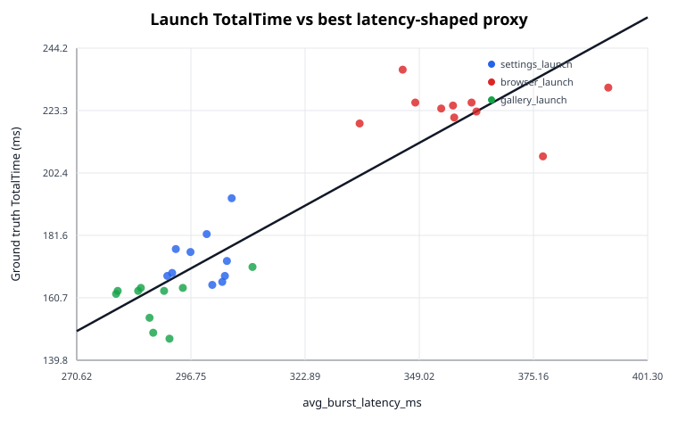

*Compares `avg_burst_latency_ms` against Android `am start -W` `TotalTime` for the best matching burst gap (20.00 ms).*

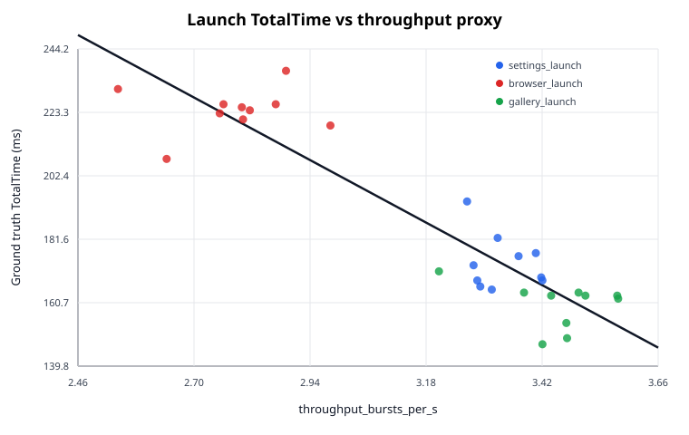

*Compares `throughput_bursts_per_s` against Android `am start -W` `TotalTime` for the best matching burst gap (20.00 ms).*

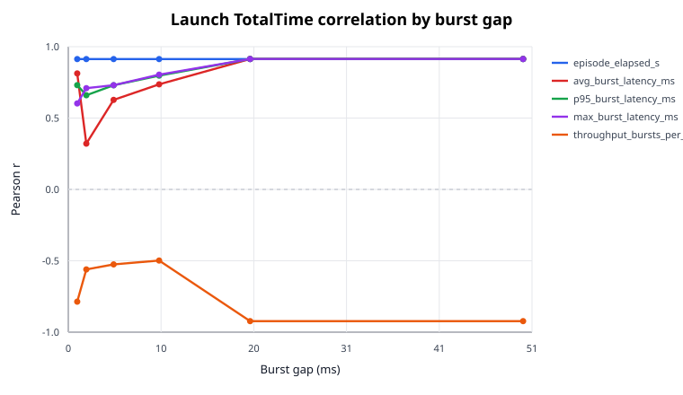

*Shows which burst-gap threshold gives the strongest correlation with launch `TotalTime`.*

## Launch Validation Recommendations

| Target | Recommended Gap (ms) | Best Proxy | Pearson r | Note |
| --- | ---: | --- | ---: | --- |
| ground_truth_total_time_ms | 20.00 | throughput_bursts_per_s | -0.922793 | proxy meaning changes with burst segmentation |
| ground_truth_wait_time_ms | 20.00 | throughput_bursts_per_s | -0.921880 | proxy meaning changes with burst segmentation |

## Launch Validation Best Fits

| Target | Best Gap (ms) | Best Proxy | N | Pearson r | Spearman r | MAE | RMSE |
| --- | ---: | --- | ---: | ---: | ---: | ---: | ---: |
| ground_truth_total_time_ms | 20.00 | throughput_bursts_per_s | 30 | -0.922793 | -0.883224 | 9.044127 | 10.996314 |
| ground_truth_wait_time_ms | 20.00 | throughput_bursts_per_s | 30 | -0.921880 | -0.796260 | 8.293429 | 10.289812 |

## Launch Validation

Best proxy fits for launch latency across the available episodes.

| Gap (ms) | Target | Proxy | N | Pearson r | Spearman r | Slope | Intercept | MAE | RMSE | Diagnostic |
| --- | --- | --- | ---: | ---: | ---: | ---: | ---: | ---: | ---: | --- |
| 1.00 | ground_truth_total_time_ms | episode_elapsed_s | 30 | 0.913158 | 0.883224 | 799.303317 | -67.076247 | 9.223782 | 11.633060 | ok |
| 1.00 | ground_truth_total_time_ms | avg_burst_latency_ms | 30 | 0.812641 | 0.796616 | 9.000973 | 121.327395 | 12.897896 | 16.632094 | ok |
| 1.00 | ground_truth_total_time_ms | p95_burst_latency_ms | 30 | 0.730544 | 0.645664 | 1.818261 | 137.067550 | 15.204751 | 19.488937 | ok |
| 1.00 | ground_truth_total_time_ms | max_burst_latency_ms | 30 | 0.602302 | 0.525882 | 0.563486 | 156.190529 | 19.091953 | 22.782546 | ok |
| 1.00 | ground_truth_total_time_ms | avg_syscalls_per_burst | 30 | 0.751754 | 0.787265 | 0.374601 | 140.877631 | 14.625394 | 18.820504 | ok |
| 1.00 | ground_truth_total_time_ms | throughput_bursts_per_s | 30 | -0.786361 | -0.781476 | -0.682824 | 269.996264 | 14.642486 | 17.631059 | ok |
| 1.00 | ground_truth_total_time_ms | trace_event_count | 30 | 0.689289 | 0.784148 | 0.014685 | 124.115327 | 15.744022 | 20.676805 | ok |
| 2.00 | ground_truth_total_time_ms | episode_elapsed_s | 30 | 0.913158 | 0.883224 | 799.303317 | -67.076247 | 9.223782 | 11.633060 | ok |
| 2.00 | ground_truth_total_time_ms | avg_burst_latency_ms | 30 | 0.320842 | 0.647223 | 0.354299 | 169.962201 | 23.749275 | 27.031120 | ok |
| 2.00 | ground_truth_total_time_ms | p95_burst_latency_ms | 30 | 0.659748 | 0.685517 | 0.336165 | 138.472064 | 17.308014 | 21.447410 | ok |
| 2.00 | ground_truth_total_time_ms | max_burst_latency_ms | 30 | 0.709377 | 0.733608 | 0.264521 | 141.350006 | 15.935609 | 20.115791 | ok |
| 2.00 | ground_truth_total_time_ms | avg_syscalls_per_burst | 30 | 0.319358 | 0.669932 | 0.017801 | 173.764700 | 23.952197 | 27.045437 | ok |
| 2.00 | ground_truth_total_time_ms | throughput_bursts_per_s | 30 | -0.560462 | -0.646777 | -1.629019 | 227.382082 | 19.499699 | 23.636223 | ok |
| 2.00 | ground_truth_total_time_ms | trace_event_count | 30 | 0.689289 | 0.784148 | 0.014685 | 124.115327 | 15.744022 | 20.676805 | ok |
| 5.00 | ground_truth_total_time_ms | episode_elapsed_s | 30 | 0.913158 | 0.883224 | 799.303317 | -67.076247 | 9.223782 | 11.633060 | ok |
| 5.00 | ground_truth_total_time_ms | avg_burst_latency_ms | 30 | 0.627387 | 0.782144 | 0.196147 | 134.291495 | 17.531358 | 22.224286 | ok |
| 5.00 | ground_truth_total_time_ms | p95_burst_latency_ms | 30 | 0.729799 | 0.832239 | 0.321192 | 92.948764 | 17.740546 | 19.511689 | ok |
| 5.00 | ground_truth_total_time_ms | max_burst_latency_ms | 30 | 0.730193 | 0.839586 | 0.328853 | 89.795247 | 17.818686 | 19.499658 | ok |
| 5.00 | ground_truth_total_time_ms | avg_syscalls_per_burst | 30 | 0.635059 | 0.708895 | 0.009934 | 149.557618 | 17.347127 | 22.046083 | ok |
| 5.00 | ground_truth_total_time_ms | throughput_bursts_per_s | 30 | -0.525292 | -0.789714 | -7.565244 | 219.380024 | 20.029160 | 24.285266 | ok |
| 5.00 | ground_truth_total_time_ms | trace_event_count | 30 | 0.689289 | 0.784148 | 0.014685 | 124.115327 | 15.744022 | 20.676805 | ok |
| 10.00 | ground_truth_total_time_ms | episode_elapsed_s | 30 | 0.913158 | 0.883224 | 799.303317 | -67.076247 | 9.223782 | 11.633060 | ok |
| 10.00 | ground_truth_total_time_ms | avg_burst_latency_ms | 30 | 0.736321 | 0.872092 | 0.462309 | 42.164328 | 15.831116 | 19.311065 | ok |
| 10.00 | ground_truth_total_time_ms | p95_burst_latency_ms | 30 | 0.797243 | 0.872092 | 0.558915 | 11.383946 | 13.618722 | 17.228396 | ok |
| 10.00 | ground_truth_total_time_ms | max_burst_latency_ms | 30 | 0.804040 | 0.872092 | 0.570467 | 7.692549 | 13.379949 | 16.969156 | ok |
| 10.00 | ground_truth_total_time_ms | avg_syscalls_per_burst | 30 | 0.679294 | 0.781699 | 0.013745 | 128.688983 | 16.675740 | 20.944497 | ok |
| 10.00 | ground_truth_total_time_ms | throughput_bursts_per_s | 30 | -0.498224 | -0.878994 | -19.060415 | 248.965961 | 22.437051 | 24.745524 | ok |
| 10.00 | ground_truth_total_time_ms | trace_event_count | 30 | 0.689289 | 0.784148 | 0.014685 | 124.115327 | 15.744022 | 20.676805 | ok |
| 20.00 | ground_truth_total_time_ms | episode_elapsed_s | 30 | 0.913158 | 0.883224 | 799.303317 | -67.076247 | 9.223782 | 11.633060 | ok |
| 20.00 | ground_truth_total_time_ms | avg_burst_latency_ms | 30 | 0.913852 | 0.876322 | 0.803336 | -67.861030 | 9.191823 | 11.588576 | ok |
| 20.00 | ground_truth_total_time_ms | p95_burst_latency_ms | 30 | 0.913852 | 0.876322 | 0.803336 | -67.861030 | 9.191823 | 11.588576 | ok |
| 20.00 | ground_truth_total_time_ms | max_burst_latency_ms | 30 | 0.913852 | 0.876322 | 0.803336 | -67.861030 | 9.191823 | 11.588576 | ok |
| 20.00 | ground_truth_total_time_ms | avg_syscalls_per_burst | 30 | 0.689289 | 0.784148 | 0.014685 | 124.115327 | 15.744022 | 20.676805 | ok |
| 20.00 | ground_truth_total_time_ms | throughput_bursts_per_s | 30 | -0.922793 | -0.883224 | -86.110919 | 460.678649 | 9.044127 | 10.996314 | ok |
| 20.00 | ground_truth_total_time_ms | trace_event_count | 30 | 0.689289 | 0.784148 | 0.014685 | 124.115327 | 15.744022 | 20.676805 | ok |
| 50.00 | ground_truth_total_time_ms | episode_elapsed_s | 30 | 0.913158 | 0.883224 | 799.303317 | -67.076247 | 9.223782 | 11.633060 | ok |
| 50.00 | ground_truth_total_time_ms | avg_burst_latency_ms | 30 | 0.913852 | 0.876322 | 0.803336 | -67.861030 | 9.191823 | 11.588576 | ok |
| 50.00 | ground_truth_total_time_ms | p95_burst_latency_ms | 30 | 0.913852 | 0.876322 | 0.803336 | -67.861030 | 9.191823 | 11.588576 | ok |
| 50.00 | ground_truth_total_time_ms | max_burst_latency_ms | 30 | 0.913852 | 0.876322 | 0.803336 | -67.861030 | 9.191823 | 11.588576 | ok |
| 50.00 | ground_truth_total_time_ms | avg_syscalls_per_burst | 30 | 0.689289 | 0.784148 | 0.014685 | 124.115327 | 15.744022 | 20.676805 | ok |
| 50.00 | ground_truth_total_time_ms | throughput_bursts_per_s | 30 | -0.922793 | -0.883224 | -86.110919 | 460.678649 | 9.044127 | 10.996314 | ok |
| 50.00 | ground_truth_total_time_ms | trace_event_count | 30 | 0.689289 | 0.784148 | 0.014685 | 124.115327 | 15.744022 | 20.676805 | ok |
| 1.00 | ground_truth_wait_time_ms | episode_elapsed_s | 30 | 0.914642 | 0.796260 | 744.949766 | -45.704636 | 8.483064 | 10.735673 | ok |
| 1.00 | ground_truth_wait_time_ms | avg_burst_latency_ms | 30 | 0.791277 | 0.659987 | 8.155110 | 131.565381 | 12.381093 | 16.237888 | ok |
| 1.00 | ground_truth_wait_time_ms | p95_burst_latency_ms | 30 | 0.720624 | 0.564685 | 1.668892 | 145.248506 | 14.212277 | 18.412000 | ok |
| 1.00 | ground_truth_wait_time_ms | max_burst_latency_ms | 30 | 0.601039 | 0.422178 | 0.523217 | 162.482755 | 17.820495 | 21.224117 | ok |
| 1.00 | ground_truth_wait_time_ms | avg_syscalls_per_burst | 30 | 0.714537 | 0.631263 | 0.331305 | 150.251768 | 14.776247 | 18.578545 | ok |
| 1.00 | ground_truth_wait_time_ms | throughput_bursts_per_s | 30 | -0.758174 | -0.673570 | -0.612585 | 265.515731 | 14.259829 | 17.315915 | ok |
| 1.00 | ground_truth_wait_time_ms | trace_event_count | 30 | 0.639723 | 0.610777 | 0.012681 | 136.715415 | 16.196715 | 20.411112 | ok |
| 2.00 | ground_truth_wait_time_ms | episode_elapsed_s | 30 | 0.914642 | 0.796260 | 744.949766 | -45.704636 | 8.483064 | 10.735673 | ok |
| 2.00 | ground_truth_wait_time_ms | avg_burst_latency_ms | 30 | 0.277556 | 0.468938 | 0.285194 | 177.244021 | 22.449584 | 25.512638 | ok |
| 2.00 | ground_truth_wait_time_ms | p95_burst_latency_ms | 30 | 0.625949 | 0.525050 | 0.296772 | 148.200315 | 16.678516 | 20.710094 | ok |
| 2.00 | ground_truth_wait_time_ms | max_burst_latency_ms | 30 | 0.679908 | 0.596527 | 0.235908 | 150.339140 | 15.384298 | 19.473469 | ok |
| 2.00 | ground_truth_wait_time_ms | avg_syscalls_per_burst | 30 | 0.270926 | 0.488087 | 0.014052 | 180.494376 | 22.643506 | 25.562849 | ok |
| 2.00 | ground_truth_wait_time_ms | throughput_bursts_per_s | 30 | -0.505017 | -0.472278 | -1.365829 | 224.852146 | 19.178754 | 22.920765 | ok |
| 2.00 | ground_truth_wait_time_ms | trace_event_count | 30 | 0.639723 | 0.610777 | 0.012681 | 136.715415 | 16.196715 | 20.411112 | ok |
| 5.00 | ground_truth_wait_time_ms | episode_elapsed_s | 30 | 0.914642 | 0.796260 | 744.949766 | -45.704636 | 8.483064 | 10.735673 | ok |
| 5.00 | ground_truth_wait_time_ms | avg_burst_latency_ms | 30 | 0.589116 | 0.667558 | 0.171379 | 144.979183 | 17.536294 | 21.458578 | ok |
| 5.00 | ground_truth_wait_time_ms | p95_burst_latency_ms | 30 | 0.685267 | 0.708751 | 0.280628 | 108.858516 | 17.801762 | 19.340549 | ok |
| 5.00 | ground_truth_wait_time_ms | max_burst_latency_ms | 30 | 0.685389 | 0.705634 | 0.287218 | 106.133677 | 17.869439 | 19.337493 | ok |
| 5.00 | ground_truth_wait_time_ms | avg_syscalls_per_burst | 30 | 0.583767 | 0.536629 | 0.008497 | 158.986596 | 17.567173 | 21.561409 | ok |
| 5.00 | ground_truth_wait_time_ms | throughput_bursts_per_s | 30 | -0.474726 | -0.671343 | -6.361720 | 218.225793 | 19.883498 | 23.372870 | ok |
| 5.00 | ground_truth_wait_time_ms | trace_event_count | 30 | 0.639723 | 0.610777 | 0.012681 | 136.715415 | 16.196715 | 20.411112 | ok |
| 10.00 | ground_truth_wait_time_ms | episode_elapsed_s | 30 | 0.914642 | 0.796260 | 744.949766 | -45.704636 | 8.483064 | 10.735673 | ok |
| 10.00 | ground_truth_wait_time_ms | avg_burst_latency_ms | 30 | 0.731672 | 0.790915 | 0.427457 | 57.169442 | 14.854675 | 18.102106 | ok |
| 10.00 | ground_truth_wait_time_ms | p95_burst_latency_ms | 30 | 0.793650 | 0.790915 | 0.517720 | 28.416059 | 12.585385 | 16.156021 | ok |
| 10.00 | ground_truth_wait_time_ms | max_burst_latency_ms | 30 | 0.800584 | 0.790915 | 0.528530 | 24.962285 | 12.314146 | 15.912943 | ok |
| 10.00 | ground_truth_wait_time_ms | avg_syscalls_per_burst | 30 | 0.630639 | 0.614340 | 0.011874 | 140.650105 | 16.669611 | 20.609519 | ok |
| 10.00 | ground_truth_wait_time_ms | throughput_bursts_per_s | 30 | -0.490161 | -0.795146 | -17.448436 | 247.801828 | 21.074239 | 23.147099 | ok |
| 10.00 | ground_truth_wait_time_ms | trace_event_count | 30 | 0.639723 | 0.610777 | 0.012681 | 136.715415 | 16.196715 | 20.411112 | ok |
| 20.00 | ground_truth_wait_time_ms | episode_elapsed_s | 30 | 0.914642 | 0.796260 | 744.949766 | -45.704636 | 8.483064 | 10.735673 | ok |
| 20.00 | ground_truth_wait_time_ms | avg_burst_latency_ms | 30 | 0.914850 | 0.792029 | 0.748309 | -46.310125 | 8.461233 | 10.723170 | ok |
| 20.00 | ground_truth_wait_time_ms | p95_burst_latency_ms | 30 | 0.914850 | 0.792029 | 0.748309 | -46.310125 | 8.461233 | 10.723170 | ok |
| 20.00 | ground_truth_wait_time_ms | max_burst_latency_ms | 30 | 0.914850 | 0.792029 | 0.748309 | -46.310125 | 8.461233 | 10.723170 | ok |
| 20.00 | ground_truth_wait_time_ms | avg_syscalls_per_burst | 30 | 0.639723 | 0.610777 | 0.012681 | 136.715415 | 16.196715 | 20.411112 | ok |
| 20.00 | ground_truth_wait_time_ms | throughput_bursts_per_s | 30 | -0.921880 | -0.796260 | -80.045758 | 445.493826 | 8.293429 | 10.289812 | ok |
| 20.00 | ground_truth_wait_time_ms | trace_event_count | 30 | 0.639723 | 0.610777 | 0.012681 | 136.715415 | 16.196715 | 20.411112 | ok |
| 50.00 | ground_truth_wait_time_ms | episode_elapsed_s | 30 | 0.914642 | 0.796260 | 744.949766 | -45.704636 | 8.483064 | 10.735673 | ok |
| 50.00 | ground_truth_wait_time_ms | avg_burst_latency_ms | 30 | 0.914850 | 0.792029 | 0.748309 | -46.310125 | 8.461233 | 10.723170 | ok |
| 50.00 | ground_truth_wait_time_ms | p95_burst_latency_ms | 30 | 0.914850 | 0.792029 | 0.748309 | -46.310125 | 8.461233 | 10.723170 | ok |
| 50.00 | ground_truth_wait_time_ms | max_burst_latency_ms | 30 | 0.914850 | 0.792029 | 0.748309 | -46.310125 | 8.461233 | 10.723170 | ok |
| 50.00 | ground_truth_wait_time_ms | avg_syscalls_per_burst | 30 | 0.639723 | 0.610777 | 0.012681 | 136.715415 | 16.196715 | 20.411112 | ok |
| 50.00 | ground_truth_wait_time_ms | throughput_bursts_per_s | 30 | -0.921880 | -0.796260 | -80.045758 | 445.493826 | 8.293429 | 10.289812 | ok |
| 50.00 | ground_truth_wait_time_ms | trace_event_count | 30 | 0.639723 | 0.610777 | 0.012681 | 136.715415 | 16.196715 | 20.411112 | ok |

## Scroll Validation Recommendations

| Target | Recommended Gap (ms) | Best Proxy | Pearson r | Note |
| --- | ---: | --- | ---: | --- |
| ground_truth_frame_p50_ms | 1.00 | avg_burst_latency_ms | 0.546310 | proxy meaning changes with burst segmentation |
| ground_truth_frame_p90_ms | 10.00 | max_burst_latency_ms | 0.930868 | proxy meaning changes with burst segmentation |
| ground_truth_frame_p95_ms | 1.00 | p95_burst_latency_ms | 0.622469 | proxy meaning changes with burst segmentation |
| ground_truth_frame_p99_ms | 1.00 | max_burst_latency_ms | 0.844547 | proxy meaning changes with burst segmentation |
| ground_truth_janky_frames | 10.00 | max_burst_latency_ms | 0.855928 | proxy meaning changes with burst segmentation |
| ground_truth_janky_frames_pct | 1.00 | p95_burst_latency_ms | 0.650713 | proxy meaning changes with burst segmentation |
| ground_truth_total_frames_rendered | 1.00 | avg_burst_latency_ms | 0.687422 | proxy meaning changes with burst segmentation |

## Scroll Validation Best Fits

| Target | Best Gap (ms) | Best Proxy | N | Pearson r | Spearman r | MAE | RMSE |
| --- | ---: | --- | ---: | ---: | ---: | ---: | ---: |
| ground_truth_frame_p50_ms | 1.00 | avg_burst_latency_ms | 40 | 0.546310 | 0.552404 | 5.382012 | 6.388149 |
| ground_truth_frame_p90_ms | 10.00 | max_burst_latency_ms | 40 | 0.930868 | 0.797444 | 8.659835 | 9.927146 |
| ground_truth_frame_p95_ms | 1.00 | p95_burst_latency_ms | 40 | 0.622469 | 0.567614 | 27.917502 | 33.863898 |
| ground_truth_frame_p99_ms | 1.00 | max_burst_latency_ms | 40 | 0.844547 | 0.839742 | 32.250433 | 36.600638 |
| ground_truth_janky_frames | 10.00 | max_burst_latency_ms | 40 | 0.855928 | 0.867104 | 1.194574 | 1.391118 |
| ground_truth_janky_frames_pct | 1.00 | p95_burst_latency_ms | 40 | 0.650713 | 0.657641 | 3.416598 | 4.222812 |
| ground_truth_total_frames_rendered | 1.00 | avg_burst_latency_ms | 40 | 0.687422 | 0.696334 | 13.720096 | 16.936933 |

Scroll validation figures:

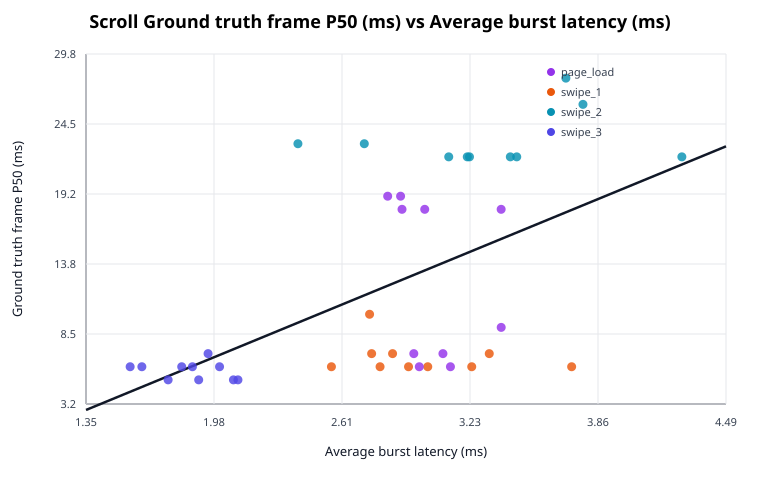

*Compares `avg_burst_latency_ms` against `ground_truth_frame_p50_ms` using the best burst gap for this target (1.00 ms).*

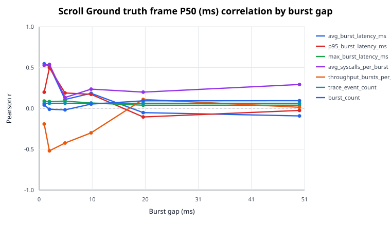

*Shows how Pearson correlation with `ground_truth_frame_p50_ms` changes across burst-gap values for the tested proxy metrics.*

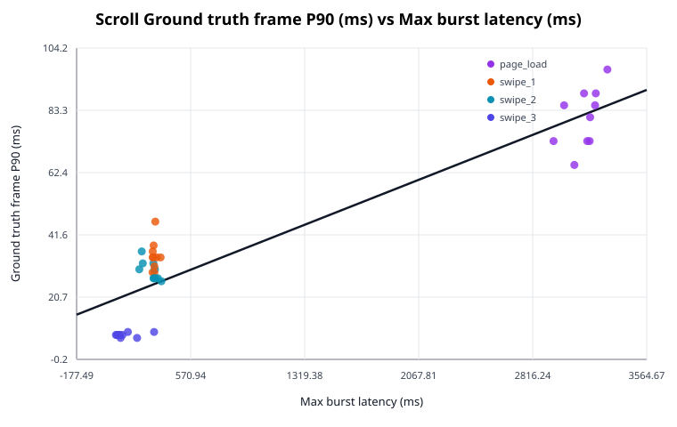

*Compares `max_burst_latency_ms` against `ground_truth_frame_p90_ms` using the best burst gap for this target (10.00 ms).*

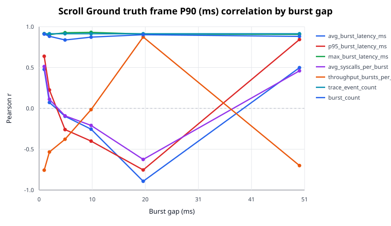

*Shows how Pearson correlation with `ground_truth_frame_p90_ms` changes across burst-gap values for the tested proxy metrics.*

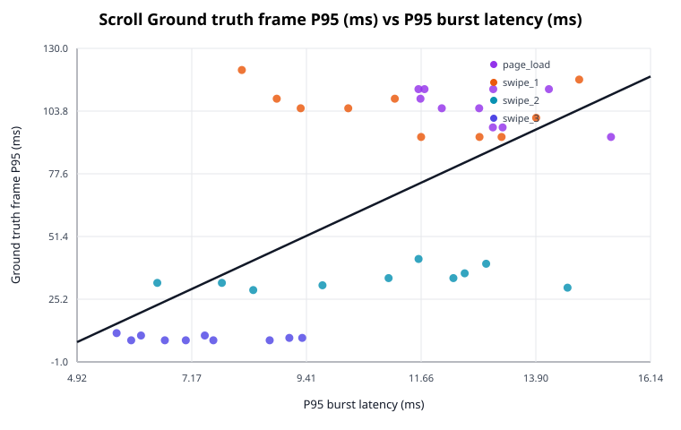

*Compares `p95_burst_latency_ms` against `ground_truth_frame_p95_ms` using the best burst gap for this target (1.00 ms).*

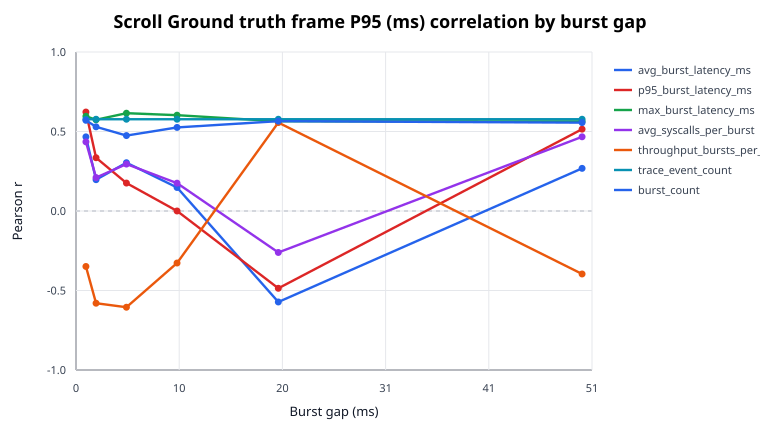

*Shows how Pearson correlation with `ground_truth_frame_p95_ms` changes across burst-gap values for the tested proxy metrics.*

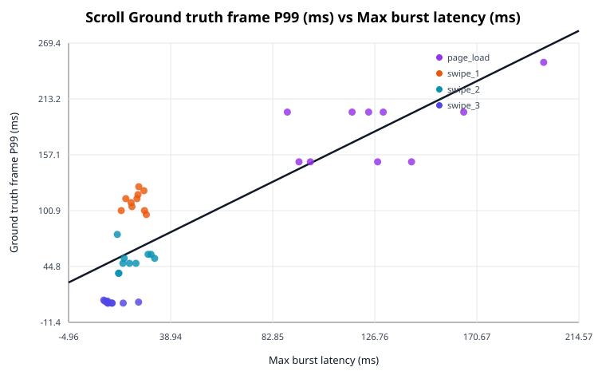

*Compares `max_burst_latency_ms` against `ground_truth_frame_p99_ms` using the best burst gap for this target (1.00 ms).*

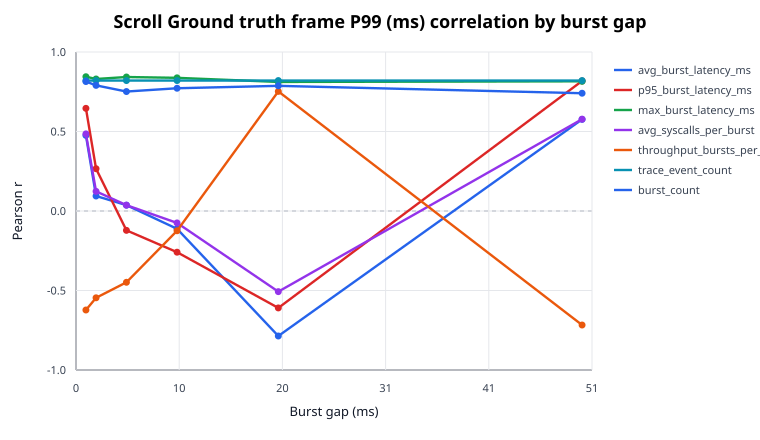

*Shows how Pearson correlation with `ground_truth_frame_p99_ms` changes across burst-gap values for the tested proxy metrics.*

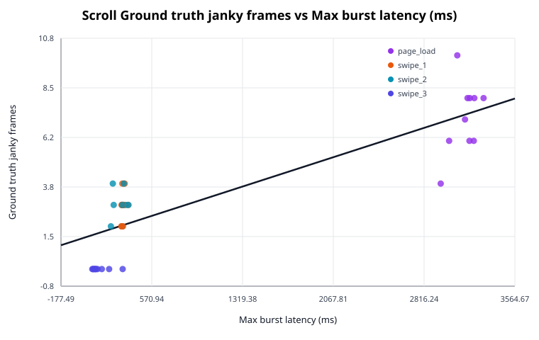

*Compares `max_burst_latency_ms` against `ground_truth_janky_frames` using the best burst gap for this target (10.00 ms).*

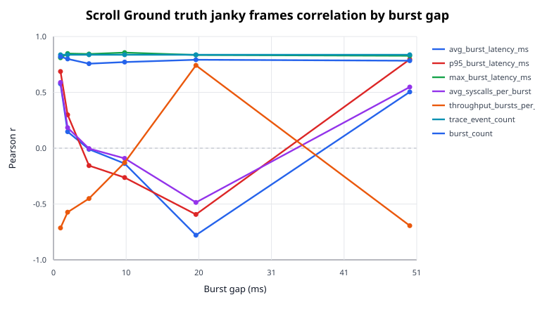

*Shows how Pearson correlation with `ground_truth_janky_frames` changes across burst-gap values for the tested proxy metrics.*

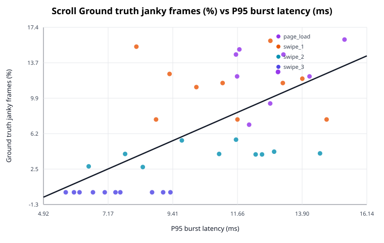

*Compares `p95_burst_latency_ms` against `ground_truth_janky_frames_pct` using the best burst gap for this target (1.00 ms).*

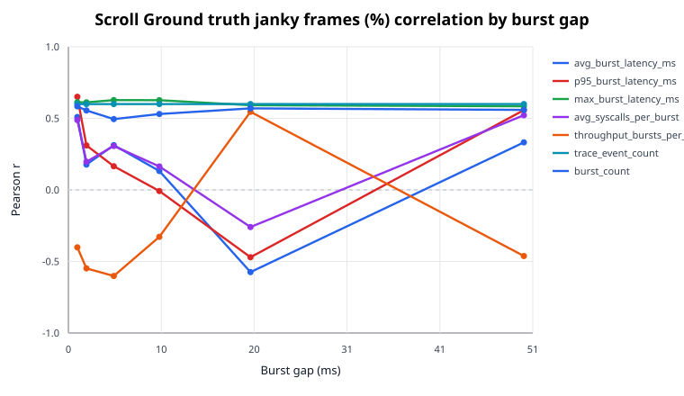

*Shows how Pearson correlation with `ground_truth_janky_frames_pct` changes across burst-gap values for the tested proxy metrics.*

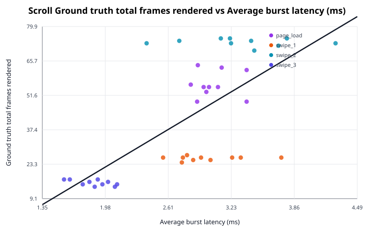

*Compares `avg_burst_latency_ms` against `ground_truth_total_frames_rendered` using the best burst gap for this target (1.00 ms).*

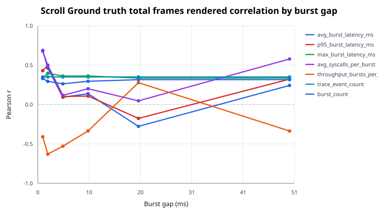

*Shows how Pearson correlation with `ground_truth_total_frames_rendered` changes across burst-gap values for the tested proxy metrics.*

## Scroll Validation

Best proxy fits for scroll responsiveness across the available episodes.

| Gap (ms) | Target | Proxy | N | Pearson r | Spearman r | Slope | Intercept | MAE | RMSE | Diagnostic |
| --- | --- | --- | ---: | ---: | ---: | ---: | ---: | ---: | ---: | --- |
| 1.00 | ground_truth_total_frames_rendered | avg_burst_latency_ms | 40 | 0.687422 | 0.696334 | 24.695505 | -26.792549 | 13.720096 | 16.936933 | ok |
| 1.00 | ground_truth_total_frames_rendered | p95_burst_latency_ms | 40 | 0.428863 | 0.412137 | 3.675174 | 3.781316 | 17.952958 | 21.067305 | ok |
| 1.00 | ground_truth_total_frames_rendered | max_burst_latency_ms | 40 | 0.338687 | 0.438384 | 0.157713 | 35.240975 | 19.135697 | 21.942527 | ok |
| 1.00 | ground_truth_total_frames_rendered | avg_syscalls_per_burst | 40 | 0.676554 | 0.675355 | 2.864818 | -38.817154 | 14.275556 | 17.173278 | ok |
| 1.00 | ground_truth_total_frames_rendered | throughput_bursts_per_s | 40 | -0.408745 | -0.249578 | -0.300918 | 100.513992 | 17.349671 | 21.283704 | ok |
| 1.00 | ground_truth_total_frames_rendered | trace_event_count | 40 | 0.350256 | 0.647775 | 0.000823 | 36.414866 | 18.518805 | 21.843531 | ok |
| 1.00 | ground_truth_total_frames_rendered | burst_count | 40 | 0.330302 | 0.192759 | 0.024645 | 36.520253 | 18.641142 | 22.011933 | ok |
| 2.00 | ground_truth_total_frames_rendered | avg_burst_latency_ms | 40 | 0.460797 | 0.608845 | 1.111219 | 24.372615 | 19.314693 | 20.697343 | ok |
| 2.00 | ground_truth_total_frames_rendered | p95_burst_latency_ms | 40 | 0.499854 | 0.533116 | 0.379422 | 21.398333 | 17.964434 | 20.198383 | ok |
| 2.00 | ground_truth_total_frames_rendered | max_burst_latency_ms | 40 | 0.396730 | 0.537443 | 0.047442 | 33.409773 | 18.293782 | 21.406995 | ok |
| 2.00 | ground_truth_total_frames_rendered | avg_syscalls_per_burst | 40 | 0.496909 | 0.598309 | 0.176450 | 21.264546 | 18.681729 | 20.237863 | ok |
| 2.00 | ground_truth_total_frames_rendered | throughput_bursts_per_s | 40 | -0.629285 | -0.558610 | -0.704317 | 80.451180 | 14.694948 | 18.124335 | ok |
| 2.00 | ground_truth_total_frames_rendered | trace_event_count | 40 | 0.350256 | 0.647775 | 0.000823 | 36.414866 | 18.518805 | 21.843531 | ok |
| 2.00 | ground_truth_total_frames_rendered | burst_count | 40 | 0.294030 | -0.206054 | 0.071581 | 37.388691 | 18.937955 | 22.289938 | ok |
| 5.00 | ground_truth_total_frames_rendered | avg_burst_latency_ms | 40 | 0.092746 | 0.497462 | 0.017014 | 40.428250 | 22.355725 | 23.220288 | ok |
| 5.00 | ground_truth_total_frames_rendered | p95_burst_latency_ms | 40 | 0.102043 | 0.168016 | 0.019271 | 39.372158 | 22.464871 | 23.199072 | ok |
| 5.00 | ground_truth_total_frames_rendered | max_burst_latency_ms | 40 | 0.361646 | 0.506681 | 0.007654 | 36.183988 | 18.484353 | 21.742348 | ok |
| 5.00 | ground_truth_total_frames_rendered | avg_syscalls_per_burst | 40 | 0.117767 | 0.516089 | 0.003408 | 39.766804 | 22.369829 | 23.158523 | ok |
| 5.00 | ground_truth_total_frames_rendered | throughput_bursts_per_s | 40 | -0.528842 | -0.492006 | -0.892937 | 57.100286 | 17.680923 | 19.792836 | ok |
| 5.00 | ground_truth_total_frames_rendered | trace_event_count | 40 | 0.350256 | 0.647775 | 0.000823 | 36.414866 | 18.518805 | 21.843531 | ok |
| 5.00 | ground_truth_total_frames_rendered | burst_count | 40 | 0.262753 | -0.104778 | 0.175215 | 38.249538 | 19.221183 | 22.501384 | ok |
| 10.00 | ground_truth_total_frames_rendered | avg_burst_latency_ms | 40 | 0.137686 | 0.419757 | 0.024296 | 37.974918 | 22.475560 | 23.098698 | ok |
| 10.00 | ground_truth_total_frames_rendered | p95_burst_latency_ms | 40 | 0.107928 | 0.213077 | 0.020306 | 38.395783 | 22.521007 | 23.184583 | ok |
| 10.00 | ground_truth_total_frames_rendered | max_burst_latency_ms | 40 | 0.362374 | 0.545346 | 0.006730 | 36.066118 | 18.473807 | 21.735753 | ok |
| 10.00 | ground_truth_total_frames_rendered | avg_syscalls_per_burst | 40 | 0.200552 | 0.548523 | 0.005474 | 36.086419 | 22.378788 | 22.846997 | ok |
| 10.00 | ground_truth_total_frames_rendered | throughput_bursts_per_s | 40 | -0.335000 | -0.477518 | -1.584506 | 54.840598 | 21.280035 | 21.973290 | ok |
| 10.00 | ground_truth_total_frames_rendered | trace_event_count | 40 | 0.350256 | 0.647775 | 0.000823 | 36.414866 | 18.518805 | 21.843531 | ok |
| 10.00 | ground_truth_total_frames_rendered | burst_count | 40 | 0.295349 | -0.116030 | 0.292307 | 38.096159 | 18.968463 | 22.280451 | ok |
| 20.00 | ground_truth_total_frames_rendered | avg_burst_latency_ms | 40 | -0.277172 | -0.048824 | -0.067672 | 62.014748 | 19.244563 | 22.407104 | ok |
| 20.00 | ground_truth_total_frames_rendered | p95_burst_latency_ms | 40 | -0.175832 | 0.013641 | -0.050109 | 57.853556 | 20.618483 | 22.957473 | ok |
| 20.00 | ground_truth_total_frames_rendered | max_burst_latency_ms | 40 | 0.335725 | 0.321544 | 0.006305 | 36.047082 | 18.608950 | 21.967264 | ok |
| 20.00 | ground_truth_total_frames_rendered | avg_syscalls_per_burst | 40 | 0.046960 | 0.280306 | 0.001845 | 39.703964 | 22.336809 | 23.295078 | ok |
| 20.00 | ground_truth_total_frames_rendered | throughput_bursts_per_s | 40 | 0.277696 | 0.045532 | 4.178546 | 26.837409 | 19.450254 | 22.403573 | ok |
| 20.00 | ground_truth_total_frames_rendered | trace_event_count | 40 | 0.350256 | 0.647775 | 0.000823 | 36.414866 | 18.518805 | 21.843531 | ok |
| 20.00 | ground_truth_total_frames_rendered | burst_count | 40 | 0.315589 | 0.239547 | 0.499633 | 38.015943 | 18.941473 | 22.129021 | ok |
| 50.00 | ground_truth_total_frames_rendered | avg_burst_latency_ms | 40 | 0.242729 | 0.218251 | 0.086142 | 11.738423 | 20.718172 | 22.623379 | ok |
| 50.00 | ground_truth_total_frames_rendered | p95_burst_latency_ms | 40 | 0.322466 | 0.322297 | 0.011376 | 34.809200 | 18.835653 | 22.075036 | ok |
| 50.00 | ground_truth_total_frames_rendered | max_burst_latency_ms | 40 | 0.336634 | 0.325777 | 0.005716 | 36.243228 | 18.522664 | 21.959699 | ok |
| 50.00 | ground_truth_total_frames_rendered | avg_syscalls_per_burst | 40 | 0.578077 | 0.665180 | 0.034352 | -25.013341 | 17.527316 | 19.029363 | ok |
| 50.00 | ground_truth_total_frames_rendered | throughput_bursts_per_s | 40 | -0.336150 | -0.326436 | -19.777910 | 97.503121 | 19.323540 | 21.963730 | ok |
| 50.00 | ground_truth_total_frames_rendered | trace_event_count | 40 | 0.350256 | 0.647775 | 0.000823 | 36.414866 | 18.518805 | 21.843531 | ok |
| 50.00 | ground_truth_total_frames_rendered | burst_count | 40 | 0.316419 | 0.244640 | 1.474062 | 37.098563 | 19.143416 | 22.122571 | ok |
| 1.00 | ground_truth_janky_frames | avg_burst_latency_ms | 40 | 0.576451 | 0.576728 | 2.388955 | -3.472460 | 1.734021 | 2.198297 | ok |
| 1.00 | ground_truth_janky_frames | p95_burst_latency_ms | 40 | 0.687016 | 0.676267 | 0.679167 | -3.942117 | 1.560592 | 1.954858 | ok |
| 1.00 | ground_truth_janky_frames | max_burst_latency_ms | 40 | 0.809791 | 0.851105 | 0.043500 | 1.192653 | 1.304092 | 1.578425 | ok |
| 1.00 | ground_truth_janky_frames | avg_syscalls_per_burst | 40 | 0.588609 | 0.619264 | 0.287523 | -4.931329 | 1.655706 | 2.174855 | ok |
| 1.00 | ground_truth_janky_frames | throughput_bursts_per_s | 40 | -0.714414 | -0.569447 | -0.060673 | 14.906862 | 1.548760 | 1.882436 | ok |
| 1.00 | ground_truth_janky_frames | trace_event_count | 40 | 0.836589 | 0.848175 | 0.000227 | 1.518221 | 1.265416 | 1.473807 | ok |
| 1.00 | ground_truth_janky_frames | burst_count | 40 | 0.819690 | 0.587318 | 0.007055 | 1.480870 | 1.308727 | 1.541001 | ok |
| 2.00 | ground_truth_janky_frames | avg_burst_latency_ms | 40 | 0.147561 | 0.295837 | 0.041050 | 2.572961 | 2.117015 | 2.660810 | ok |
| 2.00 | ground_truth_janky_frames | p95_burst_latency_ms | 40 | 0.299236 | 0.444521 | 0.026203 | 1.778924 | 2.096313 | 2.566990 | ok |
| 2.00 | ground_truth_janky_frames | max_burst_latency_ms | 40 | 0.847507 | 0.802055 | 0.011691 | 0.960579 | 1.212449 | 1.427947 | ok |
| 2.00 | ground_truth_janky_frames | avg_syscalls_per_burst | 40 | 0.183755 | 0.328505 | 0.007527 | 2.335579 | 2.117168 | 2.644451 | ok |
| 2.00 | ground_truth_janky_frames | throughput_bursts_per_s | 40 | -0.573342 | -0.533330 | -0.074026 | 7.217781 | 1.754920 | 2.204173 | ok |
| 2.00 | ground_truth_janky_frames | trace_event_count | 40 | 0.836589 | 0.848175 | 0.000227 | 1.518221 | 1.265416 | 1.473807 | ok |
| 2.00 | ground_truth_janky_frames | burst_count | 40 | 0.799250 | 0.296566 | 0.022446 | 1.584505 | 1.361526 | 1.616843 | ok |
| 5.00 | ground_truth_janky_frames | avg_burst_latency_ms | 40 | -0.009964 | 0.326398 | -0.000211 | 3.278155 | 2.069516 | 2.690127 | ok |
| 5.00 | ground_truth_janky_frames | p95_burst_latency_ms | 40 | -0.156077 | -0.161139 | -0.003400 | 3.837180 | 2.059067 | 2.657291 | ok |
| 5.00 | ground_truth_janky_frames | max_burst_latency_ms | 40 | 0.843378 | 0.881187 | 0.002059 | 1.497044 | 1.209527 | 1.445535 | ok |
| 5.00 | ground_truth_janky_frames | avg_syscalls_per_burst | 40 | -0.003540 | 0.303692 | -0.000012 | 3.260170 | 2.073009 | 2.690243 | ok |
| 5.00 | ground_truth_janky_frames | throughput_bursts_per_s | 40 | -0.450960 | -0.326685 | -0.087838 | 4.666554 | 1.920971 | 2.401177 | ok |
| 5.00 | ground_truth_janky_frames | trace_event_count | 40 | 0.836589 | 0.848175 | 0.000227 | 1.518221 | 1.265416 | 1.473807 | ok |
| 5.00 | ground_truth_janky_frames | burst_count | 40 | 0.756773 | 0.266153 | 0.058216 | 1.771324 | 1.504029 | 1.758565 | ok |
| 10.00 | ground_truth_janky_frames | avg_burst_latency_ms | 40 | -0.137417 | 0.101071 | -0.002797 | 3.794018 | 2.037124 | 2.664738 | ok |
| 10.00 | ground_truth_janky_frames | p95_burst_latency_ms | 40 | -0.263072 | -0.213830 | -0.005710 | 4.460281 | 2.035785 | 2.595499 | ok |
| 10.00 | ground_truth_janky_frames | max_burst_latency_ms | 40 | 0.855928 | 0.867104 | 0.001834 | 1.442416 | 1.194574 | 1.391118 | ok |
| 10.00 | ground_truth_janky_frames | avg_syscalls_per_burst | 40 | -0.091247 | 0.189409 | -0.000287 | 3.597118 | 2.017612 | 2.679037 | ok |
| 10.00 | ground_truth_janky_frames | throughput_bursts_per_s | 40 | -0.128976 | -0.196394 | -0.070374 | 3.789208 | 2.112156 | 2.667790 | ok |
| 10.00 | ground_truth_janky_frames | trace_event_count | 40 | 0.836589 | 0.848175 | 0.000227 | 1.518221 | 1.265416 | 1.473807 | ok |
| 10.00 | ground_truth_janky_frames | burst_count | 40 | 0.771195 | 0.318152 | 0.088048 | 1.863245 | 1.482934 | 1.712617 | ok |
| 20.00 | ground_truth_janky_frames | avg_burst_latency_ms | 40 | -0.779117 | -0.502482 | -0.021944 | 9.513152 | 1.457285 | 1.686467 | ok |
| 20.00 | ground_truth_janky_frames | p95_burst_latency_ms | 40 | -0.593481 | -0.383496 | -0.019511 | 9.150307 | 1.594896 | 2.165251 | ok |
| 20.00 | ground_truth_janky_frames | max_burst_latency_ms | 40 | 0.834514 | 0.631910 | 0.001808 | 1.342291 | 1.274143 | 1.482300 | ok |
| 20.00 | ground_truth_janky_frames | avg_syscalls_per_burst | 40 | -0.485902 | -0.270749 | -0.002202 | 6.826194 | 1.937380 | 2.351324 | ok |
| 20.00 | ground_truth_janky_frames | throughput_bursts_per_s | 40 | 0.741700 | 0.486099 | 1.287461 | -1.637458 | 1.512867 | 1.804442 | ok |
| 20.00 | ground_truth_janky_frames | trace_event_count | 40 | 0.836589 | 0.848175 | 0.000227 | 1.518221 | 1.265416 | 1.473807 | ok |
| 20.00 | ground_truth_janky_frames | burst_count | 40 | 0.791884 | 0.731467 | 0.144624 | 1.894146 | 1.399821 | 1.642864 | ok |
| 50.00 | ground_truth_janky_frames | avg_burst_latency_ms | 40 | 0.503855 | 0.275239 | 0.020628 | -4.164105 | 1.810713 | 2.323814 | ok |
| 50.00 | ground_truth_janky_frames | p95_burst_latency_ms | 40 | 0.795368 | 0.627599 | 0.003237 | 1.004792 | 1.385306 | 1.630637 | ok |
| 50.00 | ground_truth_janky_frames | max_burst_latency_ms | 40 | 0.827586 | 0.623767 | 0.001621 | 1.418861 | 1.268700 | 1.510146 | ok |
| 50.00 | ground_truth_janky_frames | avg_syscalls_per_burst | 40 | 0.547666 | 0.547151 | 0.003754 | -4.150393 | 1.755459 | 2.250933 | ok |
| 50.00 | ground_truth_janky_frames | throughput_bursts_per_s | 40 | -0.694014 | -0.605565 | -4.710485 | 16.302404 | 1.619105 | 1.936885 | ok |
| 50.00 | ground_truth_janky_frames | trace_event_count | 40 | 0.836589 | 0.848175 | 0.000227 | 1.518221 | 1.265416 | 1.473807 | ok |
| 50.00 | ground_truth_janky_frames | burst_count | 40 | 0.783371 | 0.739213 | 0.420990 | 1.650239 | 1.468396 | 1.672142 | ok |
| 1.00 | ground_truth_janky_frames_pct | avg_burst_latency_ms | 40 | 0.509299 | 0.469325 | 4.363141 | -5.256771 | 4.182931 | 4.785980 | ok |
| 1.00 | ground_truth_janky_frames_pct | p95_burst_latency_ms | 40 | 0.650713 | 0.657641 | 1.329781 | -7.060872 | 3.416598 | 4.222812 | ok |
| 1.00 | ground_truth_janky_frames_pct | max_burst_latency_ms | 40 | 0.612645 | 0.764993 | 0.068031 | 3.803459 | 3.658841 | 4.395405 | ok |
| 1.00 | ground_truth_janky_frames_pct | avg_syscalls_per_burst | 40 | 0.488133 | 0.497605 | 0.492906 | -7.004437 | 4.195451 | 4.853714 | ok |
| 1.00 | ground_truth_janky_frames_pct | throughput_bursts_per_s | 40 | -0.401380 | -0.331800 | -0.070466 | 20.559397 | 4.372128 | 5.093644 | ok |
| 1.00 | ground_truth_janky_frames_pct | trace_event_count | 40 | 0.599838 | 0.700473 | 0.000336 | 4.454183 | 3.580901 | 4.449700 | ok |
| 1.00 | ground_truth_janky_frames_pct | burst_count | 40 | 0.583848 | 0.520818 | 0.010388 | 4.416103 | 3.639955 | 4.514999 | ok |
| 2.00 | ground_truth_janky_frames_pct | avg_burst_latency_ms | 40 | 0.176965 | 0.334732 | 0.101767 | 5.342545 | 4.953044 | 5.473509 | ok |
| 2.00 | ground_truth_janky_frames_pct | p95_burst_latency_ms | 40 | 0.310750 | 0.454948 | 0.056250 | 3.862994 | 4.777471 | 5.285952 | ok |
| 2.00 | ground_truth_janky_frames_pct | max_burst_latency_ms | 40 | 0.611727 | 0.689421 | 0.017444 | 3.604981 | 3.589871 | 4.399359 | ok |
| 2.00 | ground_truth_janky_frames_pct | avg_syscalls_per_burst | 40 | 0.196846 | 0.359702 | 0.016669 | 4.996046 | 4.935069 | 5.452471 | ok |
| 2.00 | ground_truth_janky_frames_pct | throughput_bursts_per_s | 40 | -0.548434 | -0.515671 | -0.146378 | 14.866833 | 3.909801 | 4.650308 | ok |
| 2.00 | ground_truth_janky_frames_pct | trace_event_count | 40 | 0.599838 | 0.700473 | 0.000336 | 4.454183 | 3.580901 | 4.449700 | ok |
| 2.00 | ground_truth_janky_frames_pct | burst_count | 40 | 0.555175 | 0.167460 | 0.032231 | 4.629496 | 3.749668 | 4.625504 | ok |
| 5.00 | ground_truth_janky_frames_pct | avg_burst_latency_ms | 40 | 0.312653 | 0.460055 | 0.013677 | 5.194757 | 4.659055 | 5.282480 | ok |
| 5.00 | ground_truth_janky_frames_pct | p95_burst_latency_ms | 40 | 0.165423 | 0.035091 | 0.007450 | 5.734503 | 4.938016 | 5.484662 | ok |
| 5.00 | ground_truth_janky_frames_pct | max_burst_latency_ms | 40 | 0.627550 | 0.823824 | 0.003167 | 4.324639 | 3.477586 | 4.329881 | ok |
| 5.00 | ground_truth_janky_frames_pct | avg_syscalls_per_burst | 40 | 0.307002 | 0.428086 | 0.002118 | 5.197562 | 4.682125 | 5.292721 | ok |
| 5.00 | ground_truth_janky_frames_pct | throughput_bursts_per_s | 40 | -0.601545 | -0.461569 | -0.242211 | 10.927108 | 3.731950 | 4.442569 | ok |
| 5.00 | ground_truth_janky_frames_pct | trace_event_count | 40 | 0.599838 | 0.700473 | 0.000336 | 4.454183 | 3.580901 | 4.449700 | ok |
| 5.00 | ground_truth_janky_frames_pct | burst_count | 40 | 0.494779 | 0.049926 | 0.078680 | 5.022522 | 3.975642 | 4.832859 | ok |
| 10.00 | ground_truth_janky_frames_pct | avg_burst_latency_ms | 40 | 0.132059 | 0.204301 | 0.005557 | 5.940259 | 4.942015 | 5.512575 | ok |
| 10.00 | ground_truth_janky_frames_pct | p95_burst_latency_ms | 40 | -0.007924 | -0.079923 | -0.000356 | 7.096358 | 4.969519 | 5.561107 | ok |
| 10.00 | ground_truth_janky_frames_pct | max_burst_latency_ms | 40 | 0.626776 | 0.757332 | 0.002776 | 4.284759 | 3.471796 | 4.333346 | ok |
| 10.00 | ground_truth_janky_frames_pct | avg_syscalls_per_burst | 40 | 0.163779 | 0.266502 | 0.001066 | 5.733053 | 4.940224 | 5.486188 | ok |
| 10.00 | ground_truth_janky_frames_pct | throughput_bursts_per_s | 40 | -0.327903 | -0.287629 | -0.369851 | 9.854824 | 4.753673 | 5.253806 | ok |
| 10.00 | ground_truth_janky_frames_pct | trace_event_count | 40 | 0.599838 | 0.700473 | 0.000336 | 4.454183 | 3.580901 | 4.449700 | ok |
| 10.00 | ground_truth_janky_frames_pct | burst_count | 40 | 0.530335 | 0.121032 | 0.125166 | 5.049639 | 3.914418 | 4.714789 | ok |
| 20.00 | ground_truth_janky_frames_pct | avg_burst_latency_ms | 40 | -0.574385 | -0.498835 | -0.033442 | 16.565961 | 3.702458 | 4.552383 | ok |
| 20.00 | ground_truth_janky_frames_pct | p95_burst_latency_ms | 40 | -0.470479 | -0.420046 | -0.031974 | 16.690167 | 4.004690 | 4.907337 | ok |
| 20.00 | ground_truth_janky_frames_pct | max_burst_latency_ms | 40 | 0.591715 | 0.387982 | 0.002650 | 4.224776 | 3.592007 | 4.483211 | ok |
| 20.00 | ground_truth_janky_frames_pct | avg_syscalls_per_burst | 40 | -0.259535 | -0.164820 | -0.002432 | 10.969655 | 4.589959 | 5.370717 | ok |
| 20.00 | ground_truth_janky_frames_pct | throughput_bursts_per_s | 40 | 0.545730 | 0.475094 | 1.958231 | -0.412832 | 3.880387 | 4.660139 | ok |
| 20.00 | ground_truth_janky_frames_pct | trace_event_count | 40 | 0.599838 | 0.700473 | 0.000336 | 4.454183 | 3.580901 | 4.449700 | ok |
| 20.00 | ground_truth_janky_frames_pct | burst_count | 40 | 0.569674 | 0.563177 | 0.215074 | 5.004684 | 3.777025 | 4.570654 | ok |
| 50.00 | ground_truth_janky_frames_pct | avg_burst_latency_ms | 40 | 0.332160 | 0.117378 | 0.028111 | -3.082711 | 4.660107 | 5.245529 | ok |
| 50.00 | ground_truth_janky_frames_pct | p95_burst_latency_ms | 40 | 0.557757 | 0.382213 | 0.004692 | 3.766280 | 3.852580 | 4.615889 | ok |
| 50.00 | ground_truth_janky_frames_pct | max_burst_latency_ms | 40 | 0.584449 | 0.373795 | 0.002366 | 4.347776 | 3.645538 | 4.512592 | ok |
| 50.00 | ground_truth_janky_frames_pct | avg_syscalls_per_burst | 40 | 0.521943 | 0.496824 | 0.007396 | -7.558505 | 4.116304 | 4.743665 | ok |
| 50.00 | ground_truth_janky_frames_pct | throughput_bursts_per_s | 40 | -0.462017 | -0.371241 | -6.482411 | 24.983281 | 4.347921 | 4.932138 | ok |
| 50.00 | ground_truth_janky_frames_pct | trace_event_count | 40 | 0.599838 | 0.700473 | 0.000336 | 4.454183 | 3.580901 | 4.449700 | ok |
| 50.00 | ground_truth_janky_frames_pct | burst_count | 40 | 0.559172 | 0.574544 | 0.621197 | 4.660451 | 3.879726 | 4.610592 | ok |
| 1.00 | ground_truth_frame_p50_ms | avg_burst_latency_ms | 40 | 0.546310 | 0.552404 | 6.418558 | -5.986666 | 5.382012 | 6.388149 | ok |
| 1.00 | ground_truth_frame_p50_ms | p95_burst_latency_ms | 40 | 0.198590 | 0.234650 | 0.556572 | 6.181120 | 6.848059 | 7.474977 | ok |
| 1.00 | ground_truth_frame_p50_ms | max_burst_latency_ms | 40 | 0.089691 | 0.249699 | 0.013659 | 11.428997 | 7.009036 | 7.596146 | ok |
| 1.00 | ground_truth_frame_p50_ms | avg_syscalls_per_burst | 40 | 0.527052 | 0.581065 | 0.729881 | -8.693444 | 5.369172 | 6.481577 | ok |
| 1.00 | ground_truth_frame_p50_ms | throughput_bursts_per_s | 40 | -0.191395 | -0.180301 | -0.046082 | 20.928502 | 6.763188 | 7.485887 | ok |
| 1.00 | ground_truth_frame_p50_ms | trace_event_count | 40 | 0.062366 | 0.441762 | 0.000048 | 11.709000 | 7.069625 | 7.612038 | ok |
| 1.00 | ground_truth_frame_p50_ms | burst_count | 40 | 0.041213 | 0.026626 | 0.001006 | 11.822829 | 7.099815 | 7.620405 | ok |
| 2.00 | ground_truth_frame_p50_ms | avg_burst_latency_ms | 40 | 0.516614 | 0.552117 | 0.407437 | 5.355133 | 5.659691 | 6.530279 | ok |
| 2.00 | ground_truth_frame_p50_ms | p95_burst_latency_ms | 40 | 0.496255 | 0.454538 | 0.123194 | 5.158605 | 5.537448 | 6.621483 | ok |
| 2.00 | ground_truth_frame_p50_ms | max_burst_latency_ms | 40 | 0.082848 | 0.430574 | 0.003240 | 11.440519 | 7.049598 | 7.600665 | ok |
| 2.00 | ground_truth_frame_p50_ms | avg_syscalls_per_burst | 40 | 0.538570 | 0.549912 | 0.062545 | 4.476946 | 5.494683 | 6.426264 | ok |
| 2.00 | ground_truth_frame_p50_ms | throughput_bursts_per_s | 40 | -0.519548 | -0.504957 | -0.190173 | 22.268240 | 5.708718 | 6.516726 | ok |
| 2.00 | ground_truth_frame_p50_ms | trace_event_count | 40 | 0.062366 | 0.441762 | 0.000048 | 11.709000 | 7.069625 | 7.612038 | ok |
| 2.00 | ground_truth_frame_p50_ms | burst_count | 40 | -0.011005 | -0.277395 | -0.000876 | 12.140011 | 7.151066 | 7.626423 | ok |
| 5.00 | ground_truth_frame_p50_ms | avg_burst_latency_ms | 40 | 0.109021 | 0.413704 | 0.006541 | 11.201668 | 7.112447 | 7.581424 | ok |
| 5.00 | ground_truth_frame_p50_ms | p95_burst_latency_ms | 40 | 0.188686 | 0.178192 | 0.011653 | 10.062553 | 7.029024 | 7.489887 | ok |
| 5.00 | ground_truth_frame_p50_ms | max_burst_latency_ms | 40 | 0.089374 | 0.327436 | 0.000619 | 11.548361 | 7.014385 | 7.596363 | ok |
| 5.00 | ground_truth_frame_p50_ms | avg_syscalls_per_burst | 40 | 0.133110 | 0.437668 | 0.001260 | 10.990744 | 7.082047 | 7.559016 | ok |
| 5.00 | ground_truth_frame_p50_ms | throughput_bursts_per_s | 40 | -0.424228 | -0.419839 | -0.234259 | 15.852875 | 6.019783 | 6.906568 | ok |
| 5.00 | ground_truth_frame_p50_ms | trace_event_count | 40 | 0.062366 | 0.441762 | 0.000048 | 11.709000 | 7.069625 | 7.612038 | ok |
| 5.00 | ground_truth_frame_p50_ms | burst_count | 40 | -0.018296 | -0.142057 | -0.003990 | 12.176347 | 7.155521 | 7.625608 | ok |
| 10.00 | ground_truth_frame_p50_ms | avg_burst_latency_ms | 40 | 0.184560 | 0.331654 | 0.010651 | 10.003612 | 7.012850 | 7.495865 | ok |
| 10.00 | ground_truth_frame_p50_ms | p95_burst_latency_ms | 40 | 0.172044 | 0.150874 | 0.010586 | 9.831101 | 7.064428 | 7.513163 | ok |
| 10.00 | ground_truth_frame_p50_ms | max_burst_latency_ms | 40 | 0.065676 | 0.333379 | 0.000399 | 11.681792 | 7.064550 | 7.610418 | ok |
| 10.00 | ground_truth_frame_p50_ms | avg_syscalls_per_burst | 40 | 0.235676 | 0.413005 | 0.002104 | 9.533277 | 6.885167 | 7.412048 | ok |
| 10.00 | ground_truth_frame_p50_ms | throughput_bursts_per_s | 40 | -0.299400 | -0.354563 | -0.463133 | 15.623558 | 6.682474 | 7.277021 | ok |
| 10.00 | ground_truth_frame_p50_ms | trace_event_count | 40 | 0.062366 | 0.441762 | 0.000048 | 11.709000 | 7.069625 | 7.612038 | ok |
| 10.00 | ground_truth_frame_p50_ms | burst_count | 40 | 0.052548 | -0.123613 | 0.017008 | 11.807116 | 7.080181 | 7.616348 | ok |
| 20.00 | ground_truth_frame_p50_ms | avg_burst_latency_ms | 40 | -0.051994 | -0.020800 | -0.004152 | 13.259940 | 7.082834 | 7.616569 | ok |
| 20.00 | ground_truth_frame_p50_ms | p95_burst_latency_ms | 40 | -0.105024 | -0.054541 | -0.009788 | 15.035116 | 6.980905 | 7.584706 | ok |
| 20.00 | ground_truth_frame_p50_ms | max_burst_latency_ms | 40 | 0.038642 | 0.154133 | 0.000237 | 11.824568 | 7.104377 | 7.621189 | ok |
| 20.00 | ground_truth_frame_p50_ms | avg_syscalls_per_burst | 40 | 0.198998 | 0.231258 | 0.002557 | 7.922835 | 7.031792 | 7.474346 | ok |
| 20.00 | ground_truth_frame_p50_ms | throughput_bursts_per_s | 40 | 0.109792 | 0.022621 | 0.540291 | 10.023947 | 6.960082 | 7.580778 | ok |
| 20.00 | ground_truth_frame_p50_ms | trace_event_count | 40 | 0.062366 | 0.441762 | 0.000048 | 11.709000 | 7.069625 | 7.612038 | ok |
| 20.00 | ground_truth_frame_p50_ms | burst_count | 40 | 0.092543 | 0.152739 | 0.047915 | 11.625794 | 7.003897 | 7.594156 | ok |
| 50.00 | ground_truth_frame_p50_ms | avg_burst_latency_ms | 40 | -0.092482 | 0.045530 | -0.010734 | 15.933026 | 7.090594 | 7.594199 | ok |
| 50.00 | ground_truth_frame_p50_ms | p95_burst_latency_ms | 40 | -0.025030 | 0.155091 | -0.000289 | 12.275313 | 7.153029 | 7.624495 | ok |
| 50.00 | ground_truth_frame_p50_ms | max_burst_latency_ms | 40 | 0.039034 | 0.159788 | 0.000217 | 11.830146 | 7.103526 | 7.621072 | ok |
| 50.00 | ground_truth_frame_p50_ms | avg_syscalls_per_burst | 40 | 0.292662 | 0.393354 | 0.005688 | 0.863644 | 6.625409 | 7.292950 | ok |
| 50.00 | ground_truth_frame_p50_ms | throughput_bursts_per_s | 40 | 0.013230 | -0.146177 | 0.254577 | 11.369585 | 7.147277 | 7.626217 | ok |
| 50.00 | ground_truth_frame_p50_ms | trace_event_count | 40 | 0.062366 | 0.441762 | 0.000048 | 11.709000 | 7.069625 | 7.612038 | ok |
| 50.00 | ground_truth_frame_p50_ms | burst_count | 40 | 0.094028 | 0.140962 | 0.143256 | 11.530626 | 7.000494 | 7.593095 | ok |
| 1.00 | ground_truth_frame_p90_ms | avg_burst_latency_ms | 40 | 0.477401 | 0.523599 | 19.982216 | -18.004469 | 19.273585 | 23.874940 | ok |
| 1.00 | ground_truth_frame_p90_ms | p95_burst_latency_ms | 40 | 0.638308 | 0.684424 | 6.373159 | -29.264317 | 16.656296 | 20.915880 | ok |
| 1.00 | ground_truth_frame_p90_ms | max_burst_latency_ms | 40 | 0.914967 | 0.808172 | 0.496410 | 14.747340 | 9.300864 | 10.964335 | ok |
| 1.00 | ground_truth_frame_p90_ms | avg_syscalls_per_burst | 40 | 0.512567 | 0.573945 | 2.528775 | -33.730205 | 18.514719 | 23.330485 | ok |
| 1.00 | ground_truth_frame_p90_ms | throughput_bursts_per_s | 40 | -0.756623 | -0.535927 | -0.648993 | 162.913197 | 15.035369 | 17.765943 | ok |
| 1.00 | ground_truth_frame_p90_ms | trace_event_count | 40 | 0.913921 | 0.782660 | 0.002501 | 19.117518 | 9.760640 | 11.028584 | ok |
| 1.00 | ground_truth_frame_p90_ms | burst_count | 40 | 0.909895 | 0.571120 | 0.079100 | 18.390731 | 10.038643 | 11.271651 | ok |
| 2.00 | ground_truth_frame_p90_ms | avg_burst_latency_ms | 40 | 0.072264 | 0.311393 | 0.203038 | 34.876291 | 22.139519 | 27.100167 | ok |
| 2.00 | ground_truth_frame_p90_ms | p95_burst_latency_ms | 40 | 0.225406 | 0.442293 | 0.199348 | 27.033143 | 22.136287 | 26.471950 | ok |
| 2.00 | ground_truth_frame_p90_ms | max_burst_latency_ms | 40 | 0.902686 | 0.799232 | 0.125768 | 13.596742 | 10.111155 | 11.691760 | ok |
| 2.00 | ground_truth_frame_p90_ms | avg_syscalls_per_burst | 40 | 0.110788 | 0.346776 | 0.045836 | 32.656786 | 22.236638 | 27.003939 | ok |
| 2.00 | ground_truth_frame_p90_ms | throughput_bursts_per_s | 40 | -0.533843 | -0.583074 | -0.696144 | 75.538151 | 19.072443 | 22.975526 | ok |
| 2.00 | ground_truth_frame_p90_ms | trace_event_count | 40 | 0.913921 | 0.782660 | 0.002501 | 19.117518 | 9.760640 | 11.028584 | ok |
| 2.00 | ground_truth_frame_p90_ms | burst_count | 40 | 0.882722 | 0.276667 | 0.250378 | 19.646982 | 11.339195 | 12.767608 | ok |
| 5.00 | ground_truth_frame_p90_ms | avg_burst_latency_ms | 40 | -0.097067 | 0.327767 | -0.020746 | 40.995148 | 21.286635 | 27.042897 | ok |
| 5.00 | ground_truth_frame_p90_ms | p95_burst_latency_ms | 40 | -0.259729 | -0.150474 | -0.057147 | 48.093854 | 20.390985 | 26.238731 | ok |
| 5.00 | ground_truth_frame_p90_ms | max_burst_latency_ms | 40 | 0.926666 | 0.874516 | 0.022849 | 18.771997 | 8.789682 | 10.213279 | ok |
| 5.00 | ground_truth_frame_p90_ms | avg_syscalls_per_burst | 40 | -0.091317 | 0.305841 | -0.003079 | 40.874940 | 21.262841 | 27.057680 | ok |
| 5.00 | ground_truth_frame_p90_ms | throughput_bursts_per_s | 40 | -0.377880 | -0.334260 | -0.743384 | 50.213474 | 21.202854 | 25.156587 | ok |
| 5.00 | ground_truth_frame_p90_ms | trace_event_count | 40 | 0.913921 | 0.782660 | 0.002501 | 19.117518 | 9.760640 | 11.028584 | ok |
| 5.00 | ground_truth_frame_p90_ms | burst_count | 40 | 0.837623 | 0.234011 | 0.650784 | 21.695084 | 13.093465 | 14.842255 | ok |
| 10.00 | ground_truth_frame_p90_ms | avg_burst_latency_ms | 40 | -0.254914 | 0.017033 | -0.052408 | 48.417493 | 20.167473 | 26.273567 | ok |
| 10.00 | ground_truth_frame_p90_ms | p95_burst_latency_ms | 40 | -0.400661 | -0.299630 | -0.087826 | 56.841748 | 19.082349 | 24.894970 | ok |
| 10.00 | ground_truth_frame_p90_ms | max_burst_latency_ms | 40 | 0.930868 | 0.797444 | 0.020141 | 18.370278 | 8.659835 | 9.927146 | ok |
| 10.00 | ground_truth_frame_p90_ms | avg_syscalls_per_burst | 40 | -0.208962 | 0.117872 | -0.006645 | 46.253626 | 20.390919 | 26.571368 | ok |
| 10.00 | ground_truth_frame_p90_ms | throughput_bursts_per_s | 40 | -0.014995 | -0.120642 | -0.082635 | 38.858158 | 21.866288 | 27.168150 | ok |
| 10.00 | ground_truth_frame_p90_ms | trace_event_count | 40 | 0.913921 | 0.782660 | 0.002501 | 19.117518 | 9.760640 | 11.028584 | ok |
| 10.00 | ground_truth_frame_p90_ms | burst_count | 40 | 0.872484 | 0.327296 | 1.006067 | 22.379441 | 11.705100 | 13.277008 | ok |
| 20.00 | ground_truth_frame_p90_ms | avg_burst_latency_ms | 40 | -0.892347 | -0.627303 | -0.253838 | 110.675033 | 10.281228 | 12.263736 | ok |
| 20.00 | ground_truth_frame_p90_ms | p95_burst_latency_ms | 40 | -0.753744 | -0.536398 | -0.250271 | 113.909451 | 11.712346 | 17.856041 | ok |
| 20.00 | ground_truth_frame_p90_ms | max_burst_latency_ms | 40 | 0.909629 | 0.510236 | 0.019904 | 17.223139 | 9.954760 | 11.287482 | ok |
| 20.00 | ground_truth_frame_p90_ms | avg_syscalls_per_burst | 40 | -0.625168 | -0.344299 | -0.028620 | 84.696195 | 17.468720 | 21.206868 | ok |
| 20.00 | ground_truth_frame_p90_ms | throughput_bursts_per_s | 40 | 0.874050 | 0.603400 | 15.323447 | -19.945844 | 10.777202 | 13.200761 | ok |
| 20.00 | ground_truth_frame_p90_ms | trace_event_count | 40 | 0.913921 | 0.782660 | 0.002501 | 19.117518 | 9.760640 | 11.028584 | ok |
| 20.00 | ground_truth_frame_p90_ms | burst_count | 40 | 0.902055 | 0.745863 | 1.663901 | 22.625924 | 10.182968 | 11.727674 | ok |
| 50.00 | ground_truth_frame_p90_ms | avg_burst_latency_ms | 40 | 0.498473 | 0.104456 | 0.206110 | -35.856411 | 17.026126 | 23.554855 | ok |
| 50.00 | ground_truth_frame_p90_ms | p95_burst_latency_ms | 40 | 0.843400 | 0.504967 | 0.034667 | 14.179352 | 11.962335 | 14.598715 | ok |
| 50.00 | ground_truth_frame_p90_ms | max_burst_latency_ms | 40 | 0.906595 | 0.508448 | 0.017935 | 17.965179 | 10.257766 | 11.466321 | ok |
| 50.00 | ground_truth_frame_p90_ms | avg_syscalls_per_burst | 40 | 0.459929 | 0.451301 | 0.031844 | -24.543888 | 19.111915 | 24.126830 | ok |
| 50.00 | ground_truth_frame_p90_ms | throughput_bursts_per_s | 40 | -0.700244 | -0.478899 | -48.002240 | 171.235645 | 14.878863 | 19.397625 | ok |
| 50.00 | ground_truth_frame_p90_ms | trace_event_count | 40 | 0.913921 | 0.782660 | 0.002501 | 19.117518 | 9.760640 | 11.028584 | ok |
| 50.00 | ground_truth_frame_p90_ms | burst_count | 40 | 0.881274 | 0.744190 | 4.783320 | 20.048384 | 10.558734 | 12.841254 | ok |
| 1.00 | ground_truth_frame_p95_ms | avg_burst_latency_ms | 40 | 0.466349 | 0.409296 | 31.083866 | -24.144241 | 35.257933 | 38.275407 | ok |
| 1.00 | ground_truth_frame_p95_ms | p95_burst_latency_ms | 40 | 0.622469 | 0.567614 | 9.897058 | -41.481058 | 27.917502 | 33.863898 | ok |
| 1.00 | ground_truth_frame_p95_ms | max_burst_latency_ms | 40 | 0.595914 | 0.708060 | 0.514852 | 38.975136 | 29.569253 | 34.746748 | ok |
| 1.00 | ground_truth_frame_p95_ms | avg_syscalls_per_burst | 40 | 0.434989 | 0.419643 | 3.417444 | -33.916871 | 35.751095 | 38.960580 | ok |
| 1.00 | ground_truth_frame_p95_ms | throughput_bursts_per_s | 40 | -0.348877 | -0.244674 | -0.476538 | 154.880026 | 36.663749 | 40.549942 | ok |
| 1.00 | ground_truth_frame_p95_ms | trace_event_count | 40 | 0.577077 | 0.640219 | 0.002514 | 44.112116 | 29.370205 | 35.336989 | ok |
| 1.00 | ground_truth_frame_p95_ms | burst_count | 40 | 0.570285 | 0.523635 | 0.078948 | 43.528848 | 29.284850 | 35.542821 | ok |
| 2.00 | ground_truth_frame_p95_ms | avg_burst_latency_ms | 40 | 0.196946 | 0.414187 | 0.881181 | 48.791639 | 41.414676 | 42.421132 | ok |
| 2.00 | ground_truth_frame_p95_ms | p95_burst_latency_ms | 40 | 0.334989 | 0.515124 | 0.471779 | 36.838179 | 39.158763 | 40.768609 | ok |
| 2.00 | ground_truth_frame_p95_ms | max_burst_latency_ms | 40 | 0.573827 | 0.657262 | 0.127314 | 38.393890 | 30.817534 | 35.435945 | ok |
| 2.00 | ground_truth_frame_p95_ms | avg_syscalls_per_burst | 40 | 0.210290 | 0.411741 | 0.138546 | 46.494236 | 41.228723 | 42.301046 | ok |
| 2.00 | ground_truth_frame_p95_ms | throughput_bursts_per_s | 40 | -0.580029 | -0.550494 | -1.204479 | 127.884741 | 31.037086 | 35.246397 | ok |
| 2.00 | ground_truth_frame_p95_ms | trace_event_count | 40 | 0.577077 | 0.640219 | 0.002514 | 44.112116 | 29.370205 | 35.336989 | ok |
| 2.00 | ground_truth_frame_p95_ms | burst_count | 40 | 0.529381 | 0.093725 | 0.239113 | 45.582823 | 30.524661 | 36.708384 | ok |
| 5.00 | ground_truth_frame_p95_ms | avg_burst_latency_ms | 40 | 0.303752 | 0.468183 | 0.103384 | 49.520751 | 38.781580 | 41.224177 | ok |
| 5.00 | ground_truth_frame_p95_ms | p95_burst_latency_ms | 40 | 0.175694 | 0.061992 | 0.061560 | 52.694170 | 41.257942 | 42.595521 | ok |
| 5.00 | ground_truth_frame_p95_ms | max_burst_latency_ms | 40 | 0.615075 | 0.781528 | 0.024151 | 42.763463 | 28.418442 | 34.115895 | ok |
| 5.00 | ground_truth_frame_p95_ms | avg_syscalls_per_burst | 40 | 0.295117 | 0.429050 | 0.015843 | 49.687273 | 38.973787 | 41.341437 | ok |
| 5.00 | ground_truth_frame_p95_ms | throughput_bursts_per_s | 40 | -0.605247 | -0.474486 | -1.896077 | 93.902823 | 29.804410 | 34.443416 | ok |
| 5.00 | ground_truth_frame_p95_ms | trace_event_count | 40 | 0.577077 | 0.640219 | 0.002514 | 44.112116 | 29.370205 | 35.336989 | ok |
| 5.00 | ground_truth_frame_p95_ms | burst_count | 40 | 0.474392 | 0.015728 | 0.586935 | 48.416851 | 32.345124 | 38.089907 | ok |
| 10.00 | ground_truth_frame_p95_ms | avg_burst_latency_ms | 40 | 0.147809 | 0.217959 | 0.048392 | 53.913676 | 41.523991 | 42.793307 | ok |
| 10.00 | ground_truth_frame_p95_ms | p95_burst_latency_ms | 40 | 0.000042 | -0.057006 | 0.000015 | 63.321859 | 41.875166 | 43.268573 | ok |
| 10.00 | ground_truth_frame_p95_ms | max_burst_latency_ms | 40 | 0.602733 | 0.729131 | 0.020767 | 42.852816 | 28.269930 | 34.525857 | ok |
| 10.00 | ground_truth_frame_p95_ms | avg_syscalls_per_burst | 40 | 0.175106 | 0.249154 | 0.008867 | 52.611338 | 41.296163 | 42.600059 | ok |
| 10.00 | ground_truth_frame_p95_ms | throughput_bursts_per_s | 40 | -0.327157 | -0.309206 | -2.871012 | 85.322898 | 38.968177 | 40.887501 | ok |
| 10.00 | ground_truth_frame_p95_ms | trace_event_count | 40 | 0.577077 | 0.640219 | 0.002514 | 44.112116 | 29.370205 | 35.336989 | ok |
| 10.00 | ground_truth_frame_p95_ms | burst_count | 40 | 0.525626 | 0.079458 | 0.965184 | 48.123355 | 30.824042 | 36.809256 | ok |
| 20.00 | ground_truth_frame_p95_ms | avg_burst_latency_ms | 40 | -0.572179 | -0.481165 | -0.259191 | 137.302681 | 28.935611 | 35.485793 | ok |
| 20.00 | ground_truth_frame_p95_ms | p95_burst_latency_ms | 40 | -0.486119 | -0.439868 | -0.257035 | 141.054961 | 32.062379 | 37.812098 | ok |
| 20.00 | ground_truth_frame_p95_ms | max_burst_latency_ms | 40 | 0.564263 | 0.333570 | 0.019662 | 42.578812 | 29.575250 | 35.722331 | ok |
| 20.00 | ground_truth_frame_p95_ms | avg_syscalls_per_burst | 40 | -0.260807 | -0.163735 | -0.019013 | 94.197358 | 38.006030 | 41.771092 | ok |
| 20.00 | ground_truth_frame_p95_ms | throughput_bursts_per_s | 40 | 0.556143 | 0.457083 | 15.526397 | 4.383718 | 30.097609 | 35.959923 | ok |
| 20.00 | ground_truth_frame_p95_ms | trace_event_count | 40 | 0.577077 | 0.640219 | 0.002514 | 44.112116 | 29.370205 | 35.336989 | ok |
| 20.00 | ground_truth_frame_p95_ms | burst_count | 40 | 0.565028 | 0.542606 | 1.659696 | 47.765349 | 29.569617 | 35.699666 | ok |
| 50.00 | ground_truth_frame_p95_ms | avg_burst_latency_ms | 40 | 0.268249 | 0.006303 | 0.176628 | -0.159713 | 38.790414 | 41.682763 | ok |
| 50.00 | ground_truth_frame_p95_ms | p95_burst_latency_ms | 40 | 0.514672 | 0.326421 | 0.033688 | 39.958334 | 33.053676 | 37.097930 | ok |
| 50.00 | ground_truth_frame_p95_ms | max_burst_latency_ms | 40 | 0.563474 | 0.337333 | 0.017751 | 43.272896 | 29.542640 | 35.745633 | ok |
| 50.00 | ground_truth_frame_p95_ms | avg_syscalls_per_burst | 40 | 0.466649 | 0.413501 | 0.051450 | -38.091238 | 34.919425 | 38.268579 | ok |
| 50.00 | ground_truth_frame_p95_ms | throughput_bursts_per_s | 40 | -0.396094 | -0.312404 | -43.238879 | 183.136724 | 36.136636 | 39.729630 | ok |
| 50.00 | ground_truth_frame_p95_ms | trace_event_count | 40 | 0.577077 | 0.640219 | 0.002514 | 44.112116 | 29.370205 | 35.336989 | ok |
| 50.00 | ground_truth_frame_p95_ms | burst_count | 40 | 0.555811 | 0.537701 | 4.804070 | 45.069533 | 30.174825 | 35.969534 | ok |
| 1.00 | ground_truth_frame_p99_ms | avg_burst_latency_ms | 40 | 0.475609 | 0.468509 | 50.077852 | -51.967856 | 50.363076 | 60.125338 | ok |
| 1.00 | ground_truth_frame_p99_ms | p95_burst_latency_ms | 40 | 0.645745 | 0.655161 | 16.218890 | -82.801842 | 42.391969 | 52.189543 | ok |
| 1.00 | ground_truth_frame_p99_ms | max_burst_latency_ms | 40 | 0.844547 | 0.839742 | 1.152641 | 34.435947 | 32.250433 | 36.600638 | ok |
| 1.00 | ground_truth_frame_p99_ms | avg_syscalls_per_burst | 40 | 0.485096 | 0.534646 | 6.020371 | -82.357038 | 49.895732 | 59.770192 | ok |
| 1.00 | ground_truth_frame_p99_ms | throughput_bursts_per_s | 40 | -0.622621 | -0.464652 | -1.343447 | 347.060431 | 46.081202 | 53.486174 | ok |
| 1.00 | ground_truth_frame_p99_ms | trace_event_count | 40 | 0.820393 | 0.806476 | 0.005647 | 45.802830 | 33.821284 | 39.083042 | ok |
| 1.00 | ground_truth_frame_p99_ms | burst_count | 40 | 0.814150 | 0.634618 | 0.178042 | 44.305861 | 34.448215 | 39.688314 | ok |
| 2.00 | ground_truth_frame_p99_ms | avg_burst_latency_ms | 40 | 0.094209 | 0.300862 | 0.665861 | 77.967923 | 58.302158 | 68.046919 | ok |
| 2.00 | ground_truth_frame_p99_ms | p95_burst_latency_ms | 40 | 0.265960 | 0.444802 | 0.591694 | 55.730894 | 55.927987 | 65.889192 | ok |
| 2.00 | ground_truth_frame_p99_ms | max_burst_latency_ms | 40 | 0.830240 | 0.790915 | 0.290985 | 31.968212 | 33.303601 | 38.099204 | ok |
| 2.00 | ground_truth_frame_p99_ms | avg_syscalls_per_burst | 40 | 0.123471 | 0.336047 | 0.128503 | 73.339302 | 58.050572 | 67.827905 | ok |
| 2.00 | ground_truth_frame_p99_ms | throughput_bursts_per_s | 40 | -0.545901 | -0.539915 | -1.790752 | 184.933800 | 46.177153 | 57.267778 | ok |
| 2.00 | ground_truth_frame_p99_ms | trace_event_count | 40 | 0.820393 | 0.806476 | 0.005647 | 45.802830 | 33.821284 | 39.083042 | ok |
| 2.00 | ground_truth_frame_p99_ms | burst_count | 40 | 0.790124 | 0.297444 | 0.563770 | 47.118289 | 36.099453 | 41.895534 | ok |
| 5.00 | ground_truth_frame_p99_ms | avg_burst_latency_ms | 40 | 0.036731 | 0.325605 | 0.019749 | 86.313074 | 58.059086 | 68.304790 | ok |
| 5.00 | ground_truth_frame_p99_ms | p95_burst_latency_ms | 40 | -0.121723 | -0.158240 | -0.067373 | 100.584631 | 59.325323 | 67.842668 | ok |
| 5.00 | ground_truth_frame_p99_ms | max_burst_latency_ms | 40 | 0.842700 | 0.894778 | 0.052271 | 44.448753 | 31.126665 | 36.798946 | ok |
| 5.00 | ground_truth_frame_p99_ms | avg_syscalls_per_burst | 40 | 0.036727 | 0.303778 | 0.003115 | 86.268987 | 58.079656 | 68.304802 | ok |
| 5.00 | ground_truth_frame_p99_ms | throughput_bursts_per_s | 40 | -0.448369 | -0.327486 | -2.218866 | 124.733394 | 48.462474 | 61.095356 | ok |
| 5.00 | ground_truth_frame_p99_ms | trace_event_count | 40 | 0.820393 | 0.806476 | 0.005647 | 45.802830 | 33.821284 | 39.083042 | ok |
| 5.00 | ground_truth_frame_p99_ms | burst_count | 40 | 0.751305 | 0.244684 | 1.468386 | 51.652992 | 37.919297 | 45.108537 | ok |
| 10.00 | ground_truth_frame_p99_ms | avg_burst_latency_ms | 40 | -0.112153 | 0.063221 | -0.058003 | 100.230613 | 59.070727 | 67.919685 | ok |
| 10.00 | ground_truth_frame_p99_ms | p95_burst_latency_ms | 40 | -0.259099 | -0.237171 | -0.142872 | 119.235002 | 57.050106 | 66.016782 | ok |
| 10.00 | ground_truth_frame_p99_ms | max_burst_latency_ms | 40 | 0.837550 | 0.847644 | 0.045587 | 44.011172 | 32.812102 | 37.344271 | ok |
| 10.00 | ground_truth_frame_p99_ms | avg_syscalls_per_burst | 40 | -0.075045 | 0.152696 | -0.006003 | 96.203251 | 59.041878 | 68.158174 | ok |
| 10.00 | ground_truth_frame_p99_ms | throughput_bursts_per_s | 40 | -0.124287 | -0.170846 | -1.722964 | 102.151476 | 56.905545 | 67.820942 | ok |
| 10.00 | ground_truth_frame_p99_ms | trace_event_count | 40 | 0.820393 | 0.806476 | 0.005647 | 45.802830 | 33.821284 | 39.083042 | ok |
| 10.00 | ground_truth_frame_p99_ms | burst_count | 40 | 0.771994 | 0.293549 | 2.239335 | 53.680481 | 37.150983 | 43.445862 | ok |
| 20.00 | ground_truth_frame_p99_ms | avg_burst_latency_ms | 40 | -0.786194 | -0.631171 | -0.562586 | 249.522100 | 37.152492 | 42.239483 | ok |
| 20.00 | ground_truth_frame_p99_ms | p95_burst_latency_ms | 40 | -0.609604 | -0.512350 | -0.509178 | 242.930431 | 42.495169 | 54.182211 | ok |
| 20.00 | ground_truth_frame_p99_ms | max_burst_latency_ms | 40 | 0.811695 | 0.498614 | 0.044679 | 41.806510 | 34.685529 | 39.922485 | ok |
| 20.00 | ground_truth_frame_p99_ms | avg_syscalls_per_burst | 40 | -0.507162 | -0.316306 | -0.058405 | 183.785158 | 48.119907 | 58.908293 | ok |
| 20.00 | ground_truth_frame_p99_ms | throughput_bursts_per_s | 40 | 0.752204 | 0.610285 | 33.173498 | -36.983178 | 37.720088 | 45.038504 | ok |
| 20.00 | ground_truth_frame_p99_ms | trace_event_count | 40 | 0.820393 | 0.806476 | 0.005647 | 45.802830 | 33.821284 | 39.083042 | ok |
| 20.00 | ground_truth_frame_p99_ms | burst_count | 40 | 0.787163 | 0.737052 | 3.652538 | 54.707453 | 36.414385 | 42.155083 | ok |
| 50.00 | ground_truth_frame_p99_ms | avg_burst_latency_ms | 40 | 0.576363 | 0.162943 | 0.599499 | -126.525865 | 48.650212 | 55.855961 | ok |
| 50.00 | ground_truth_frame_p99_ms | p95_burst_latency_ms | 40 | 0.818011 | 0.504259 | 0.084582 | 30.282479 | 33.914749 | 39.315576 | ok |
| 50.00 | ground_truth_frame_p99_ms | max_burst_latency_ms | 40 | 0.815546 | 0.498614 | 0.040585 | 43.103475 | 34.277060 | 39.554136 | ok |
| 50.00 | ground_truth_frame_p99_ms | avg_syscalls_per_burst | 40 | 0.577618 | 0.524228 | 0.100603 | -109.353205 | 45.223272 | 55.795364 | ok |
| 50.00 | ground_truth_frame_p99_ms | throughput_bursts_per_s | 40 | -0.717109 | -0.484220 | -123.661072 | 431.605651 | 41.449885 | 47.637901 | ok |
| 50.00 | ground_truth_frame_p99_ms | trace_event_count | 40 | 0.820393 | 0.806476 | 0.005647 | 45.802830 | 33.821284 | 39.083042 | ok |
| 50.00 | ground_truth_frame_p99_ms | burst_count | 40 | 0.740697 | 0.728016 | 10.113328 | 50.519354 | 40.077903 | 45.920863 | ok |

## Memory Validation Recommendations

| Target | Recommended Gap (ms) | Best Proxy | Pearson r | Note |
| --- | ---: | --- | ---: | --- |
| ground_truth_dalvik_heap_pss_kb | 1.00 | file_syscall_intensity | 0.866039 | proxy is mostly gap-invariant |
| ground_truth_graphics_pss_kb | 1.00 | long_tail_share | 0.801329 | proxy is mostly gap-invariant |
| ground_truth_native_heap_pss_kb | 2.00 | avg_burst_latency_ms | 0.529410 | proxy meaning changes with burst segmentation |
| ground_truth_total_pss_kb | 1.00 | long_tail_share | 0.776984 | proxy is mostly gap-invariant |

## Memory Validation Best Fits

| Target | Best Gap (ms) | Best Proxy | N | Pearson r | Spearman r | MAE | RMSE |
| --- | ---: | --- | ---: | ---: | ---: | ---: | ---: |
| ground_truth_dalvik_heap_pss_kb | 1.00 | file_syscall_intensity | 10 | 0.866039 | 0.762209 | 3.264631 | 4.207242 |
| ground_truth_graphics_pss_kb | 1.00 | long_tail_share | 10 | 0.801329 | 0.393939 | 3183.832501 | 3988.804027 |
| ground_truth_native_heap_pss_kb | 2.00 | avg_burst_latency_ms | 10 | 0.529410 | 0.442424 | 260.266670 | 329.012764 |
| ground_truth_total_pss_kb | 1.00 | long_tail_share | 10 | 0.776984 | 0.406061 | 3456.962197 | 4346.921448 |

Memory validation figures:

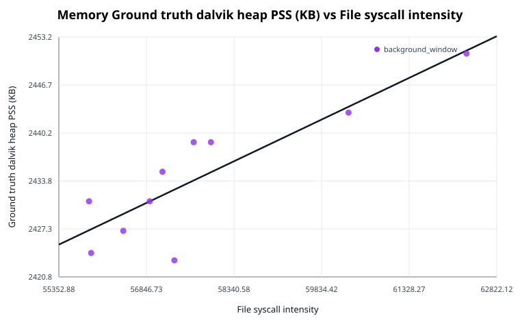

*Compares `file_syscall_intensity` against `ground_truth_dalvik_heap_pss_kb` using the best burst gap for this target (1.00 ms).*

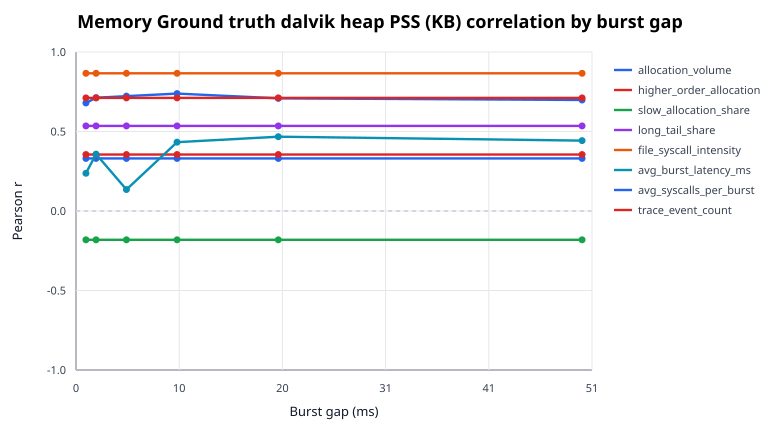

*Shows how Pearson correlation with `ground_truth_dalvik_heap_pss_kb` changes across burst-gap values for the tested proxy metrics.*

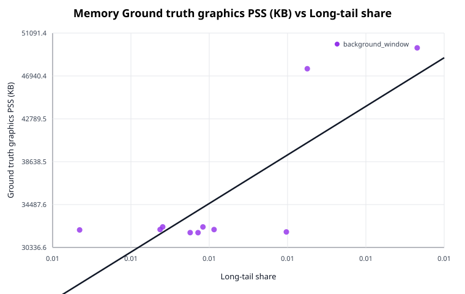

*Compares `long_tail_share` against `ground_truth_graphics_pss_kb` using the best burst gap for this target (1.00 ms).*

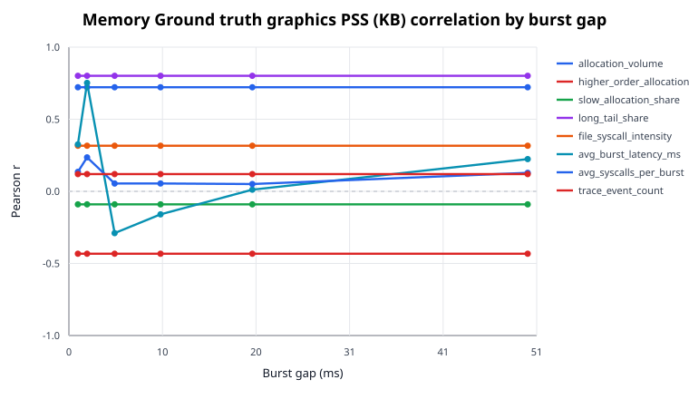

*Shows how Pearson correlation with `ground_truth_graphics_pss_kb` changes across burst-gap values for the tested proxy metrics.*

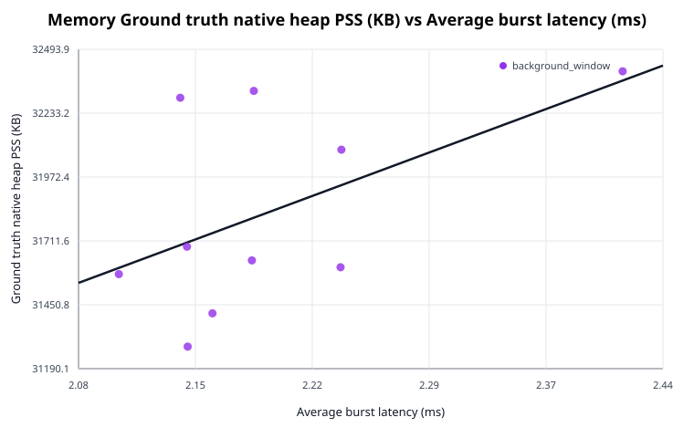

*Compares `avg_burst_latency_ms` against `ground_truth_native_heap_pss_kb` using the best burst gap for this target (2.00 ms).*

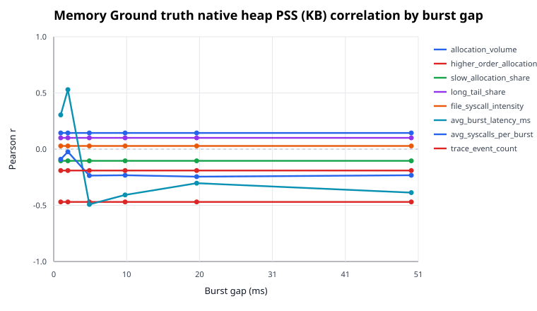

*Shows how Pearson correlation with `ground_truth_native_heap_pss_kb` changes across burst-gap values for the tested proxy metrics.*

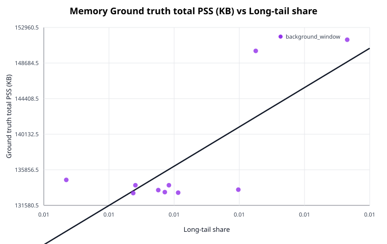

*Compares `long_tail_share` against `ground_truth_total_pss_kb` using the best burst gap for this target (1.00 ms).*

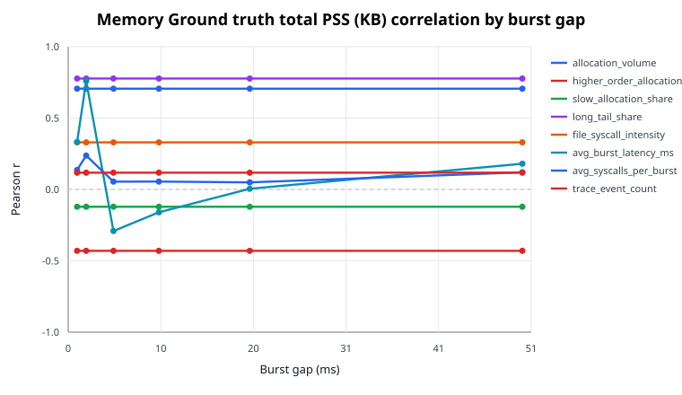

*Shows how Pearson correlation with `ground_truth_total_pss_kb` changes across burst-gap values for the tested proxy metrics.*

## Memory Validation

Best proxy fits for memory pressure across the available episodes.

| Gap (ms) | Target | Proxy | N | Pearson r | Spearman r | Slope | Intercept | MAE | RMSE | Diagnostic |
| --- | --- | --- | ---: | ---: | ---: | ---: | ---: | ---: | ---: | --- |
| 1.00 | ground_truth_total_pss_kb | allocation_volume | 10 | 0.705861 | 0.151515 | 0.742285 | 4822.883238 | 3998.600783 | 4891.251857 | ok |
| 1.00 | ground_truth_total_pss_kb | higher_order_allocation_share | 10 | -0.430197 | -0.345455 | -2692870.823436 | 181190.669251 | 5015.445573 | 6233.506436 | ok |
| 1.00 | ground_truth_total_pss_kb | slow_allocation_share | 10 | -0.121359 | -0.369697 | -172398.068010 | 163828.647017 | 5448.465959 | 6854.096595 | ok |
| 1.00 | ground_truth_total_pss_kb | long_tail_share | 10 | 0.776984 | 0.406061 | 19726478.646889 | 8318.345646 | 3456.962197 | 4346.921448 | ok |
| 1.00 | ground_truth_total_pss_kb | file_syscall_intensity | 10 | 0.329727 | 0.357576 | 1.180374 | 68850.476552 | 4872.096033 | 6518.973396 | ok |
| 1.00 | ground_truth_total_pss_kb | avg_burst_latency_ms | 10 | 0.331747 | 0.187879 | 65147.005724 | 82588.535802 | 5310.926227 | 6514.086138 | ok |
| 1.00 | ground_truth_total_pss_kb | avg_syscalls_per_burst | 10 | 0.136378 | 0.066667 | 855.728677 | 130062.042820 | 5383.551133 | 6840.619215 | ok |
| 1.00 | ground_truth_total_pss_kb | trace_event_count | 10 | 0.117269 | 0.260606 | 0.446186 | 131768.160152 | 5420.197429 | 6857.490687 | ok |
| 2.00 | ground_truth_total_pss_kb | allocation_volume | 10 | 0.705861 | 0.151515 | 0.742285 | 4822.883238 | 3998.600783 | 4891.251857 | ok |
| 2.00 | ground_truth_total_pss_kb | higher_order_allocation_share | 10 | -0.430197 | -0.345455 | -2692870.823436 | 181190.669251 | 5015.445573 | 6233.506436 | ok |
| 2.00 | ground_truth_total_pss_kb | slow_allocation_share | 10 | -0.121359 | -0.369697 | -172398.068010 | 163828.647017 | 5448.465959 | 6854.096595 | ok |
| 2.00 | ground_truth_total_pss_kb | long_tail_share | 10 | 0.776984 | 0.406061 | 19726478.646889 | 8318.345646 | 3456.962197 | 4346.921448 | ok |
| 2.00 | ground_truth_total_pss_kb | file_syscall_intensity | 10 | 0.329727 | 0.357576 | 1.180374 | 68850.476552 | 4872.096033 | 6518.973396 | ok |
| 2.00 | ground_truth_total_pss_kb | avg_burst_latency_ms | 10 | 0.759620 | 0.309091 | 63770.501764 | -3051.171964 | 3102.760188 | 4490.869654 | ok |
| 2.00 | ground_truth_total_pss_kb | avg_syscalls_per_burst | 10 | 0.237040 | 0.103030 | 947.605273 | 124610.577134 | 5159.275012 | 6708.338075 | ok |
| 2.00 | ground_truth_total_pss_kb | trace_event_count | 10 | 0.117269 | 0.260606 | 0.446186 | 131768.160152 | 5420.197429 | 6857.490687 | ok |
| 5.00 | ground_truth_total_pss_kb | allocation_volume | 10 | 0.705861 | 0.151515 | 0.742285 | 4822.883238 | 3998.600783 | 4891.251857 | ok |
| 5.00 | ground_truth_total_pss_kb | higher_order_allocation_share | 10 | -0.430197 | -0.345455 | -2692870.823436 | 181190.669251 | 5015.445573 | 6233.506436 | ok |
| 5.00 | ground_truth_total_pss_kb | slow_allocation_share | 10 | -0.121359 | -0.369697 | -172398.068010 | 163828.647017 | 5448.465959 | 6854.096595 | ok |
| 5.00 | ground_truth_total_pss_kb | long_tail_share | 10 | 0.776984 | 0.406061 | 19726478.646889 | 8318.345646 | 3456.962197 | 4346.921448 | ok |
| 5.00 | ground_truth_total_pss_kb | file_syscall_intensity | 10 | 0.329727 | 0.357576 | 1.180374 | 68850.476552 | 4872.096033 | 6518.973396 | ok |
| 5.00 | ground_truth_total_pss_kb | avg_burst_latency_ms | 10 | -0.291395 | 0.151515 | -6499.236548 | 172519.283073 | 5334.254595 | 6605.471019 | ok |
| 5.00 | ground_truth_total_pss_kb | avg_syscalls_per_burst | 10 | 0.054443 | 0.151515 | 136.477073 | 134172.215149 | 5485.014283 | 6894.893376 | ok |
| 5.00 | ground_truth_total_pss_kb | trace_event_count | 10 | 0.117269 | 0.260606 | 0.446186 | 131768.160152 | 5420.197429 | 6857.490687 | ok |
| 10.00 | ground_truth_total_pss_kb | allocation_volume | 10 | 0.705861 | 0.151515 | 0.742285 | 4822.883238 | 3998.600783 | 4891.251857 | ok |
| 10.00 | ground_truth_total_pss_kb | higher_order_allocation_share | 10 | -0.430197 | -0.345455 | -2692870.823436 | 181190.669251 | 5015.445573 | 6233.506436 | ok |
| 10.00 | ground_truth_total_pss_kb | slow_allocation_share | 10 | -0.121359 | -0.369697 | -172398.068010 | 163828.647017 | 5448.465959 | 6854.096595 | ok |
| 10.00 | ground_truth_total_pss_kb | long_tail_share | 10 | 0.776984 | 0.406061 | 19726478.646889 | 8318.345646 | 3456.962197 | 4346.921448 | ok |
| 10.00 | ground_truth_total_pss_kb | file_syscall_intensity | 10 | 0.329727 | 0.357576 | 1.180374 | 68850.476552 | 4872.096033 | 6518.973396 | ok |
| 10.00 | ground_truth_total_pss_kb | avg_burst_latency_ms | 10 | -0.160208 | 0.030303 | -2017.090959 | 155801.736318 | 5352.446335 | 6815.943248 | ok |
| 10.00 | ground_truth_total_pss_kb | avg_syscalls_per_burst | 10 | 0.055052 | 0.187879 | 95.496883 | 134428.327791 | 5484.395130 | 6894.662743 | ok |
| 10.00 | ground_truth_total_pss_kb | trace_event_count | 10 | 0.117269 | 0.260606 | 0.446186 | 131768.160152 | 5420.197429 | 6857.490687 | ok |
| 20.00 | ground_truth_total_pss_kb | allocation_volume | 10 | 0.705861 | 0.151515 | 0.742285 | 4822.883238 | 3998.600783 | 4891.251857 | ok |
| 20.00 | ground_truth_total_pss_kb | higher_order_allocation_share | 10 | -0.430197 | -0.345455 | -2692870.823436 | 181190.669251 | 5015.445573 | 6233.506436 | ok |
| 20.00 | ground_truth_total_pss_kb | slow_allocation_share | 10 | -0.121359 | -0.369697 | -172398.068010 | 163828.647017 | 5448.465959 | 6854.096595 | ok |
| 20.00 | ground_truth_total_pss_kb | long_tail_share | 10 | 0.776984 | 0.406061 | 19726478.646889 | 8318.345646 | 3456.962197 | 4346.921448 | ok |
| 20.00 | ground_truth_total_pss_kb | file_syscall_intensity | 10 | 0.329727 | 0.357576 | 1.180374 | 68850.476552 | 4872.096033 | 6518.973396 | ok |
| 20.00 | ground_truth_total_pss_kb | avg_burst_latency_ms | 10 | 0.004761 | 0.248485 | 22.354240 | 136690.115413 | 5506.595305 | 6905.056295 | ok |
| 20.00 | ground_truth_total_pss_kb | avg_syscalls_per_burst | 10 | 0.049389 | 0.260606 | 54.611920 | 135112.589168 | 5489.686015 | 6896.707700 | ok |
| 20.00 | ground_truth_total_pss_kb | trace_event_count | 10 | 0.117269 | 0.260606 | 0.446186 | 131768.160152 | 5420.197429 | 6857.490687 | ok |
| 50.00 | ground_truth_total_pss_kb | allocation_volume | 10 | 0.705861 | 0.151515 | 0.742285 | 4822.883238 | 3998.600783 | 4891.251857 | ok |
| 50.00 | ground_truth_total_pss_kb | higher_order_allocation_share | 10 | -0.430197 | -0.345455 | -2692870.823436 | 181190.669251 | 5015.445573 | 6233.506436 | ok |
| 50.00 | ground_truth_total_pss_kb | slow_allocation_share | 10 | -0.121359 | -0.369697 | -172398.068010 | 163828.647017 | 5448.465959 | 6854.096595 | ok |
| 50.00 | ground_truth_total_pss_kb | long_tail_share | 10 | 0.776984 | 0.406061 | 19726478.646889 | 8318.345646 | 3456.962197 | 4346.921448 | ok |
| 50.00 | ground_truth_total_pss_kb | file_syscall_intensity | 10 | 0.329727 | 0.357576 | 1.180374 | 68850.476552 | 4872.096033 | 6518.973396 | ok |
| 50.00 | ground_truth_total_pss_kb | avg_burst_latency_ms | 10 | 0.180063 | -0.151515 | 415.584331 | 116155.454599 | 5317.457785 | 6792.271308 | ok |
| 50.00 | ground_truth_total_pss_kb | avg_syscalls_per_burst | 10 | 0.120181 | 0.163636 | 76.811646 | 132429.173354 | 5414.068181 | 6855.086253 | ok |
| 50.00 | ground_truth_total_pss_kb | trace_event_count | 10 | 0.117269 | 0.260606 | 0.446186 | 131768.160152 | 5420.197429 | 6857.490687 | ok |
| 1.00 | ground_truth_graphics_pss_kb | allocation_volume | 10 | 0.721916 | 0.563636 | 0.733069 | -95234.456102 | 3641.549480 | 4613.948269 | ok |
| 1.00 | ground_truth_graphics_pss_kb | higher_order_allocation_share | 10 | -0.432658 | -0.648485 | -2615167.200875 | 78217.959240 | 4836.544888 | 6011.359768 | ok |
| 1.00 | ground_truth_graphics_pss_kb | slow_allocation_share | 10 | -0.090227 | -0.284848 | -123767.098244 | 54575.613685 | 5278.363170 | 6640.548368 | ok |
| 1.00 | ground_truth_graphics_pss_kb | long_tail_share | 10 | 0.801329 | 0.393939 | 19645138.805900 | -92849.846820 | 3183.832501 | 3988.804027 | ok |
| 1.00 | ground_truth_graphics_pss_kb | file_syscall_intensity | 10 | 0.316277 | -0.018182 | 1.093301 | -27817.690609 | 4732.474958 | 6325.467534 | ok |
| 1.00 | ground_truth_graphics_pss_kb | avg_burst_latency_ms | 10 | 0.325530 | 0.127273 | 61728.440488 | -16252.650321 | 5107.982511 | 6304.564466 | ok |
| 1.00 | ground_truth_graphics_pss_kb | avg_syscalls_per_burst | 10 | 0.135130 | 0.284848 | 818.748862 | 28664.997374 | 5202.453061 | 6606.587446 | ok |
| 1.00 | ground_truth_graphics_pss_kb | trace_event_count | 10 | 0.119609 | 0.563636 | 0.439446 | 30148.939921 | 5235.097210 | 6619.877324 | ok |
| 2.00 | ground_truth_graphics_pss_kb | allocation_volume | 10 | 0.721916 | 0.563636 | 0.733069 | -95234.456102 | 3641.549480 | 4613.948269 | ok |
| 2.00 | ground_truth_graphics_pss_kb | higher_order_allocation_share | 10 | -0.432658 | -0.648485 | -2615167.200875 | 78217.959240 | 4836.544888 | 6011.359768 | ok |
| 2.00 | ground_truth_graphics_pss_kb | slow_allocation_share | 10 | -0.090227 | -0.284848 | -123767.098244 | 54575.613685 | 5278.363170 | 6640.548368 | ok |
| 2.00 | ground_truth_graphics_pss_kb | long_tail_share | 10 | 0.801329 | 0.393939 | 19645138.805900 | -92849.846820 | 3183.832501 | 3988.804027 | ok |
| 2.00 | ground_truth_graphics_pss_kb | file_syscall_intensity | 10 | 0.316277 | -0.018182 | 1.093301 | -27817.690609 | 4732.474958 | 6325.467534 | ok |
| 2.00 | ground_truth_graphics_pss_kb | avg_burst_latency_ms | 10 | 0.752342 | 0.490909 | 60988.144171 | -98637.472841 | 2843.162982 | 4392.527449 | ok |
| 2.00 | ground_truth_graphics_pss_kb | avg_syscalls_per_burst | 10 | 0.235580 | 0.345455 | 909.391639 | 23413.191721 | 4986.866906 | 6480.081453 | ok |
| 2.00 | ground_truth_graphics_pss_kb | trace_event_count | 10 | 0.119609 | 0.563636 | 0.439446 | 30148.939921 | 5235.097210 | 6619.877324 | ok |
| 5.00 | ground_truth_graphics_pss_kb | allocation_volume | 10 | 0.721916 | 0.563636 | 0.733069 | -95234.456102 | 3641.549480 | 4613.948269 | ok |
| 5.00 | ground_truth_graphics_pss_kb | higher_order_allocation_share | 10 | -0.432658 | -0.648485 | -2615167.200875 | 78217.959240 | 4836.544888 | 6011.359768 | ok |
| 5.00 | ground_truth_graphics_pss_kb | slow_allocation_share | 10 | -0.090227 | -0.284848 | -123767.098244 | 54575.613685 | 5278.363170 | 6640.548368 | ok |
| 5.00 | ground_truth_graphics_pss_kb | long_tail_share | 10 | 0.801329 | 0.393939 | 19645138.805900 | -92849.846820 | 3183.832501 | 3988.804027 | ok |
| 5.00 | ground_truth_graphics_pss_kb | file_syscall_intensity | 10 | 0.316277 | -0.018182 | 1.093301 | -27817.690609 | 4732.474958 | 6325.467534 | ok |
| 5.00 | ground_truth_graphics_pss_kb | avg_burst_latency_ms | 10 | -0.289812 | 0.127273 | -6241.703637 | 69414.785340 | 5135.710902 | 6381.589305 | ok |
| 5.00 | ground_truth_graphics_pss_kb | avg_syscalls_per_burst | 10 | 0.054307 | 0.503030 | 131.456682 | 32579.054110 | 5299.395084 | 6657.904892 | ok |
| 5.00 | ground_truth_graphics_pss_kb | trace_event_count | 10 | 0.119609 | 0.563636 | 0.439446 | 30148.939921 | 5235.097210 | 6619.877324 | ok |
| 10.00 | ground_truth_graphics_pss_kb | allocation_volume | 10 | 0.721916 | 0.563636 | 0.733069 | -95234.456102 | 3641.549480 | 4613.948269 | ok |
| 10.00 | ground_truth_graphics_pss_kb | higher_order_allocation_share | 10 | -0.432658 | -0.648485 | -2615167.200875 | 78217.959240 | 4836.544888 | 6011.359768 | ok |
| 10.00 | ground_truth_graphics_pss_kb | slow_allocation_share | 10 | -0.090227 | -0.284848 | -123767.098244 | 54575.613685 | 5278.363170 | 6640.548368 | ok |
| 10.00 | ground_truth_graphics_pss_kb | long_tail_share | 10 | 0.801329 | 0.393939 | 19645138.805900 | -92849.846820 | 3183.832501 | 3988.804027 | ok |
| 10.00 | ground_truth_graphics_pss_kb | file_syscall_intensity | 10 | 0.316277 | -0.018182 | 1.093301 | -27817.690609 | 4732.474958 | 6325.467534 | ok |
| 10.00 | ground_truth_graphics_pss_kb | avg_burst_latency_ms | 10 | -0.159598 | -0.139394 | -1940.331928 | 53389.128854 | 5171.898849 | 6582.278357 | ok |
| 10.00 | ground_truth_graphics_pss_kb | avg_syscalls_per_burst | 10 | 0.054510 | 0.430303 | 91.305176 | 32844.376227 | 5298.953981 | 6657.831358 | ok |
| 10.00 | ground_truth_graphics_pss_kb | trace_event_count | 10 | 0.119609 | 0.563636 | 0.439446 | 30148.939921 | 5235.097210 | 6619.877324 | ok |
| 20.00 | ground_truth_graphics_pss_kb | allocation_volume | 10 | 0.721916 | 0.563636 | 0.733069 | -95234.456102 | 3641.549480 | 4613.948269 | ok |
| 20.00 | ground_truth_graphics_pss_kb | higher_order_allocation_share | 10 | -0.432658 | -0.648485 | -2615167.200875 | 78217.959240 | 4836.544888 | 6011.359768 | ok |
| 20.00 | ground_truth_graphics_pss_kb | slow_allocation_share | 10 | -0.090227 | -0.284848 | -123767.098244 | 54575.613685 | 5278.363170 | 6640.548368 | ok |
| 20.00 | ground_truth_graphics_pss_kb | long_tail_share | 10 | 0.801329 | 0.393939 | 19645138.805900 | -92849.846820 | 3183.832501 | 3988.804027 | ok |
| 20.00 | ground_truth_graphics_pss_kb | file_syscall_intensity | 10 | 0.316277 | -0.018182 | 1.093301 | -27817.690609 | 4732.474958 | 6325.467534 | ok |
| 20.00 | ground_truth_graphics_pss_kb | avg_burst_latency_ms | 10 | 0.011569 | 0.442424 | 52.448108 | 34507.437005 | 5320.673627 | 6667.298489 | ok |
| 20.00 | ground_truth_graphics_pss_kb | avg_syscalls_per_burst | 10 | 0.050627 | 0.563636 | 54.055874 | 33433.309305 | 5303.454564 | 6659.194384 | ok |
| 20.00 | ground_truth_graphics_pss_kb | trace_event_count | 10 | 0.119609 | 0.563636 | 0.439446 | 30148.939921 | 5235.097210 | 6619.877324 | ok |
| 50.00 | ground_truth_graphics_pss_kb | allocation_volume | 10 | 0.721916 | 0.563636 | 0.733069 | -95234.456102 | 3641.549480 | 4613.948269 | ok |
| 50.00 | ground_truth_graphics_pss_kb | higher_order_allocation_share | 10 | -0.432658 | -0.648485 | -2615167.200875 | 78217.959240 | 4836.544888 | 6011.359768 | ok |
| 50.00 | ground_truth_graphics_pss_kb | slow_allocation_share | 10 | -0.090227 | -0.284848 | -123767.098244 | 54575.613685 | 5278.363170 | 6640.548368 | ok |
| 50.00 | ground_truth_graphics_pss_kb | long_tail_share | 10 | 0.801329 | 0.393939 | 19645138.805900 | -92849.846820 | 3183.832501 | 3988.804027 | ok |
| 50.00 | ground_truth_graphics_pss_kb | file_syscall_intensity | 10 | 0.316277 | -0.018182 | 1.093301 | -27817.690609 | 4732.474958 | 6325.467534 | ok |
| 50.00 | ground_truth_graphics_pss_kb | avg_burst_latency_ms | 10 | 0.223638 | 0.248485 | 498.410896 | 10292.260700 | 5061.035537 | 6498.866516 | ok |
| 50.00 | ground_truth_graphics_pss_kb | avg_syscalls_per_burst | 10 | 0.128379 | 0.466667 | 79.230757 | 30584.663627 | 5224.765316 | 6612.570033 | ok |
| 50.00 | ground_truth_graphics_pss_kb | trace_event_count | 10 | 0.119609 | 0.563636 | 0.439446 | 30148.939921 | 5235.097210 | 6619.877324 | ok |
| 1.00 | ground_truth_native_heap_pss_kb | allocation_volume | 10 | 0.144000 | 0.139394 | 0.008505 | 30315.382085 | 349.220747 | 383.777387 | ok |
| 1.00 | ground_truth_native_heap_pss_kb | higher_order_allocation_share | 10 | -0.469742 | -0.503030 | -165144.561448 | 34537.433137 | 284.266286 | 342.368463 | ok |
| 1.00 | ground_truth_native_heap_pss_kb | slow_allocation_share | 10 | -0.104017 | -0.151515 | -8298.907620 | 33119.500856 | 352.590785 | 385.715635 | ok |
| 1.00 | ground_truth_native_heap_pss_kb | long_tail_share | 10 | 0.100385 | 0.054545 | 143141.032678 | 30896.290249 | 347.924302 | 385.860330 | ok |
| 1.00 | ground_truth_native_heap_pss_kb | file_syscall_intensity | 10 | 0.028283 | 0.078788 | 0.005687 | 31501.846485 | 355.733943 | 387.664194 | ok |
| 1.00 | ground_truth_native_heap_pss_kb | avg_burst_latency_ms | 10 | 0.304610 | 0.284848 | 3359.608787 | 29021.871874 | 336.331631 | 369.389103 | ok |
| 1.00 | ground_truth_native_heap_pss_kb | avg_syscalls_per_burst | 10 | -0.090076 | 0.272727 | -31.743779 | 32089.600291 | 354.690276 | 386.242814 | ok |
| 1.00 | ground_truth_native_heap_pss_kb | trace_event_count | 10 | -0.190313 | 0.054545 | -0.040669 | 32311.771599 | 344.797947 | 380.731317 | ok |
| 2.00 | ground_truth_native_heap_pss_kb | allocation_volume | 10 | 0.144000 | 0.139394 | 0.008505 | 30315.382085 | 349.220747 | 383.777387 | ok |
| 2.00 | ground_truth_native_heap_pss_kb | higher_order_allocation_share | 10 | -0.469742 | -0.503030 | -165144.561448 | 34537.433137 | 284.266286 | 342.368463 | ok |
| 2.00 | ground_truth_native_heap_pss_kb | slow_allocation_share | 10 | -0.104017 | -0.151515 | -8298.907620 | 33119.500856 | 352.590785 | 385.715635 | ok |
| 2.00 | ground_truth_native_heap_pss_kb | long_tail_share | 10 | 0.100385 | 0.054545 | 143141.032678 | 30896.290249 | 347.924302 | 385.860330 | ok |
| 2.00 | ground_truth_native_heap_pss_kb | file_syscall_intensity | 10 | 0.028283 | 0.078788 | 0.005687 | 31501.846485 | 355.733943 | 387.664194 | ok |
| 2.00 | ground_truth_native_heap_pss_kb | avg_burst_latency_ms | 10 | 0.529410 | 0.442424 | 2496.161850 | 26346.458473 | 260.266670 | 329.012764 | ok |
| 2.00 | ground_truth_native_heap_pss_kb | avg_syscalls_per_burst | 10 | -0.023608 | 0.248485 | -5.300520 | 31899.977733 | 357.159692 | 387.711253 | ok |
| 2.00 | ground_truth_native_heap_pss_kb | trace_event_count | 10 | -0.190313 | 0.054545 | -0.040669 | 32311.771599 | 344.797947 | 380.731317 | ok |
| 5.00 | ground_truth_native_heap_pss_kb | allocation_volume | 10 | 0.144000 | 0.139394 | 0.008505 | 30315.382085 | 349.220747 | 383.777387 | ok |
| 5.00 | ground_truth_native_heap_pss_kb | higher_order_allocation_share | 10 | -0.469742 | -0.503030 | -165144.561448 | 34537.433137 | 284.266286 | 342.368463 | ok |
| 5.00 | ground_truth_native_heap_pss_kb | slow_allocation_share | 10 | -0.104017 | -0.151515 | -8298.907620 | 33119.500856 | 352.590785 | 385.715635 | ok |
| 5.00 | ground_truth_native_heap_pss_kb | long_tail_share | 10 | 0.100385 | 0.054545 | 143141.032678 | 30896.290249 | 347.924302 | 385.860330 | ok |
| 5.00 | ground_truth_native_heap_pss_kb | file_syscall_intensity | 10 | 0.028283 | 0.078788 | 0.005687 | 31501.846485 | 355.733943 | 387.664194 | ok |
| 5.00 | ground_truth_native_heap_pss_kb | avg_burst_latency_ms | 10 | -0.491902 | -0.563636 | -616.192185 | 35193.297254 | 309.914621 | 337.655091 | ok |
| 5.00 | ground_truth_native_heap_pss_kb | avg_syscalls_per_burst | 10 | -0.235316 | -0.090909 | -33.130354 | 32528.848102 | 337.623932 | 376.928914 | ok |
| 5.00 | ground_truth_native_heap_pss_kb | trace_event_count | 10 | -0.190313 | 0.054545 | -0.040669 | 32311.771599 | 344.797947 | 380.731317 | ok |
| 10.00 | ground_truth_native_heap_pss_kb | allocation_volume | 10 | 0.144000 | 0.139394 | 0.008505 | 30315.382085 | 349.220747 | 383.777387 | ok |
| 10.00 | ground_truth_native_heap_pss_kb | higher_order_allocation_share | 10 | -0.469742 | -0.503030 | -165144.561448 | 34537.433137 | 284.266286 | 342.368463 | ok |
| 10.00 | ground_truth_native_heap_pss_kb | slow_allocation_share | 10 | -0.104017 | -0.151515 | -8298.907620 | 33119.500856 | 352.590785 | 385.715635 | ok |
| 10.00 | ground_truth_native_heap_pss_kb | long_tail_share | 10 | 0.100385 | 0.054545 | 143141.032678 | 30896.290249 | 347.924302 | 385.860330 | ok |
| 10.00 | ground_truth_native_heap_pss_kb | file_syscall_intensity | 10 | 0.028283 | 0.078788 | 0.005687 | 31501.846485 | 355.733943 | 387.664194 | ok |
| 10.00 | ground_truth_native_heap_pss_kb | avg_burst_latency_ms | 10 | -0.407366 | -0.490909 | -288.060620 | 34508.419846 | 330.139408 | 354.181893 | ok |
| 10.00 | ground_truth_native_heap_pss_kb | avg_syscalls_per_burst | 10 | -0.232238 | 0.078788 | -22.625814 | 32451.403436 | 339.271828 | 377.215974 | ok |
| 10.00 | ground_truth_native_heap_pss_kb | trace_event_count | 10 | -0.190313 | 0.054545 | -0.040669 | 32311.771599 | 344.797947 | 380.731317 | ok |
| 20.00 | ground_truth_native_heap_pss_kb | allocation_volume | 10 | 0.144000 | 0.139394 | 0.008505 | 30315.382085 | 349.220747 | 383.777387 | ok |
| 20.00 | ground_truth_native_heap_pss_kb | higher_order_allocation_share | 10 | -0.469742 | -0.503030 | -165144.561448 | 34537.433137 | 284.266286 | 342.368463 | ok |
| 20.00 | ground_truth_native_heap_pss_kb | slow_allocation_share | 10 | -0.104017 | -0.151515 | -8298.907620 | 33119.500856 | 352.590785 | 385.715635 | ok |
| 20.00 | ground_truth_native_heap_pss_kb | long_tail_share | 10 | 0.100385 | 0.054545 | 143141.032678 | 30896.290249 | 347.924302 | 385.860330 | ok |
| 20.00 | ground_truth_native_heap_pss_kb | file_syscall_intensity | 10 | 0.028283 | 0.078788 | 0.005687 | 31501.846485 | 355.733943 | 387.664194 | ok |
| 20.00 | ground_truth_native_heap_pss_kb | avg_burst_latency_ms | 10 | -0.302946 | -0.151515 | -79.880355 | 33114.262977 | 322.945008 | 369.594866 | ok |
| 20.00 | ground_truth_native_heap_pss_kb | avg_syscalls_per_burst | 10 | -0.244904 | 0.054545 | -15.209352 | 32369.799414 | 336.711878 | 376.009227 | ok |
| 20.00 | ground_truth_native_heap_pss_kb | trace_event_count | 10 | -0.190313 | 0.054545 | -0.040669 | 32311.771599 | 344.797947 | 380.731317 | ok |
| 50.00 | ground_truth_native_heap_pss_kb | allocation_volume | 10 | 0.144000 | 0.139394 | 0.008505 | 30315.382085 | 349.220747 | 383.777387 | ok |
| 50.00 | ground_truth_native_heap_pss_kb | higher_order_allocation_share | 10 | -0.469742 | -0.503030 | -165144.561448 | 34537.433137 | 284.266286 | 342.368463 | ok |
| 50.00 | ground_truth_native_heap_pss_kb | slow_allocation_share | 10 | -0.104017 | -0.151515 | -8298.907620 | 33119.500856 | 352.590785 | 385.715635 | ok |
| 50.00 | ground_truth_native_heap_pss_kb | long_tail_share | 10 | 0.100385 | 0.054545 | 143141.032678 | 30896.290249 | 347.924302 | 385.860330 | ok |
| 50.00 | ground_truth_native_heap_pss_kb | file_syscall_intensity | 10 | 0.028283 | 0.078788 | 0.005687 | 31501.846485 | 355.733943 | 387.664194 | ok |
| 50.00 | ground_truth_native_heap_pss_kb | avg_burst_latency_ms | 10 | -0.386872 | -0.212121 | -50.148763 | 34351.682555 | 303.561311 | 357.621210 | ok |
| 50.00 | ground_truth_native_heap_pss_kb | avg_syscalls_per_burst | 10 | -0.232461 | 0.042424 | -8.344495 | 32332.322050 | 338.710241 | 377.195264 | ok |
| 50.00 | ground_truth_native_heap_pss_kb | trace_event_count | 10 | -0.190313 | 0.054545 | -0.040669 | 32311.771599 | 344.797947 | 380.731317 | ok |
| 1.00 | ground_truth_dalvik_heap_pss_kb | allocation_volume | 10 | 0.330643 | 0.390251 | 0.000424 | 2358.819675 | 5.831870 | 7.941581 | ok |
| 1.00 | ground_truth_dalvik_heap_pss_kb | higher_order_allocation_share | 10 | 0.355161 | 0.152442 | 2709.244924 | 2389.890328 | 6.506946 | 7.866262 | ok |
| 1.00 | ground_truth_dalvik_heap_pss_kb | slow_allocation_share | 10 | -0.181133 | -0.353665 | -313.569097 | 2483.007879 | 6.980683 | 8.275674 | ok |
| 1.00 | ground_truth_dalvik_heap_pss_kb | long_tail_share | 10 | 0.535098 | 0.542693 | 16555.643216 | 2326.261184 | 6.261560 | 7.108795 | ok |
| 1.00 | ground_truth_dalvik_heap_pss_kb | file_syscall_intensity | 10 | 0.866039 | 0.762209 | 0.003778 | 2216.009404 | 3.264631 | 4.207242 | ok |
| 1.00 | ground_truth_dalvik_heap_pss_kb | avg_burst_latency_ms | 10 | 0.237385 | 0.256102 | 56.808924 | 2386.809512 | 7.307784 | 8.174334 | ok |
| 1.00 | ground_truth_dalvik_heap_pss_kb | avg_syscalls_per_burst | 10 | 0.679448 | 0.280493 | 5.195454 | 2391.877097 | 5.246349 | 6.174191 | ok |
| 1.00 | ground_truth_dalvik_heap_pss_kb | trace_event_count | 10 | 0.711344 | 0.542693 | 0.003298 | 2395.260101 | 4.719215 | 5.914339 | ok |
| 2.00 | ground_truth_dalvik_heap_pss_kb | allocation_volume | 10 | 0.330643 | 0.390251 | 0.000424 | 2358.819675 | 5.831870 | 7.941581 | ok |
| 2.00 | ground_truth_dalvik_heap_pss_kb | higher_order_allocation_share | 10 | 0.355161 | 0.152442 | 2709.244924 | 2389.890328 | 6.506946 | 7.866262 | ok |
| 2.00 | ground_truth_dalvik_heap_pss_kb | slow_allocation_share | 10 | -0.181133 | -0.353665 | -313.569097 | 2483.007879 | 6.980683 | 8.275674 | ok |
| 2.00 | ground_truth_dalvik_heap_pss_kb | long_tail_share | 10 | 0.535098 | 0.542693 | 16555.643216 | 2326.261184 | 6.261560 | 7.108795 | ok |
| 2.00 | ground_truth_dalvik_heap_pss_kb | file_syscall_intensity | 10 | 0.866039 | 0.762209 | 0.003778 | 2216.009404 | 3.264631 | 4.207242 | ok |
| 2.00 | ground_truth_dalvik_heap_pss_kb | avg_burst_latency_ms | 10 | 0.357639 | 0.335372 | 36.588414 | 2353.917103 | 5.700363 | 7.858307 | ok |
| 2.00 | ground_truth_dalvik_heap_pss_kb | avg_syscalls_per_burst | 10 | 0.712530 | 0.353665 | 3.471242 | 2388.734442 | 4.837939 | 5.904220 | ok |
| 2.00 | ground_truth_dalvik_heap_pss_kb | trace_event_count | 10 | 0.711344 | 0.542693 | 0.003298 | 2395.260101 | 4.719215 | 5.914339 | ok |
| 5.00 | ground_truth_dalvik_heap_pss_kb | allocation_volume | 10 | 0.330643 | 0.390251 | 0.000424 | 2358.819675 | 5.831870 | 7.941581 | ok |
| 5.00 | ground_truth_dalvik_heap_pss_kb | higher_order_allocation_share | 10 | 0.355161 | 0.152442 | 2709.244924 | 2389.890328 | 6.506946 | 7.866262 | ok |
| 5.00 | ground_truth_dalvik_heap_pss_kb | slow_allocation_share | 10 | -0.181133 | -0.353665 | -313.569097 | 2483.007879 | 6.980683 | 8.275674 | ok |
| 5.00 | ground_truth_dalvik_heap_pss_kb | long_tail_share | 10 | 0.535098 | 0.542693 | 16555.643216 | 2326.261184 | 6.261560 | 7.108795 | ok |
| 5.00 | ground_truth_dalvik_heap_pss_kb | file_syscall_intensity | 10 | 0.866039 | 0.762209 | 0.003778 | 2216.009404 | 3.264631 | 4.207242 | ok |
| 5.00 | ground_truth_dalvik_heap_pss_kb | avg_burst_latency_ms | 10 | 0.135056 | 0.201223 | 3.670885 | 2414.265977 | 7.164772 | 8.337770 | ok |
| 5.00 | ground_truth_dalvik_heap_pss_kb | avg_syscalls_per_burst | 10 | 0.722537 | 0.554888 | 2.207251 | 2387.767134 | 4.761224 | 5.817470 | ok |
| 5.00 | ground_truth_dalvik_heap_pss_kb | trace_event_count | 10 | 0.711344 | 0.542693 | 0.003298 | 2395.260101 | 4.719215 | 5.914339 | ok |
| 10.00 | ground_truth_dalvik_heap_pss_kb | allocation_volume | 10 | 0.330643 | 0.390251 | 0.000424 | 2358.819675 | 5.831870 | 7.941581 | ok |
| 10.00 | ground_truth_dalvik_heap_pss_kb | higher_order_allocation_share | 10 | 0.355161 | 0.152442 | 2709.244924 | 2389.890328 | 6.506946 | 7.866262 | ok |
| 10.00 | ground_truth_dalvik_heap_pss_kb | slow_allocation_share | 10 | -0.181133 | -0.353665 | -313.569097 | 2483.007879 | 6.980683 | 8.275674 | ok |
| 10.00 | ground_truth_dalvik_heap_pss_kb | long_tail_share | 10 | 0.535098 | 0.542693 | 16555.643216 | 2326.261184 | 6.261560 | 7.108795 | ok |
| 10.00 | ground_truth_dalvik_heap_pss_kb | file_syscall_intensity | 10 | 0.866039 | 0.762209 | 0.003778 | 2216.009404 | 3.264631 | 4.207242 | ok |
| 10.00 | ground_truth_dalvik_heap_pss_kb | avg_burst_latency_ms | 10 | 0.432876 | 0.402447 | 6.641722 | 2372.553746 | 6.444154 | 7.585612 | ok |
| 10.00 | ground_truth_dalvik_heap_pss_kb | avg_syscalls_per_burst | 10 | 0.738445 | 0.524400 | 1.561015 | 2391.455319 | 4.635971 | 5.674260 | ok |
| 10.00 | ground_truth_dalvik_heap_pss_kb | trace_event_count | 10 | 0.711344 | 0.542693 | 0.003298 | 2395.260101 | 4.719215 | 5.914339 | ok |
| 20.00 | ground_truth_dalvik_heap_pss_kb | allocation_volume | 10 | 0.330643 | 0.390251 | 0.000424 | 2358.819675 | 5.831870 | 7.941581 | ok |
| 20.00 | ground_truth_dalvik_heap_pss_kb | higher_order_allocation_share | 10 | 0.355161 | 0.152442 | 2709.244924 | 2389.890328 | 6.506946 | 7.866262 | ok |
| 20.00 | ground_truth_dalvik_heap_pss_kb | slow_allocation_share | 10 | -0.181133 | -0.353665 | -313.569097 | 2483.007879 | 6.980683 | 8.275674 | ok |
| 20.00 | ground_truth_dalvik_heap_pss_kb | long_tail_share | 10 | 0.535098 | 0.542693 | 16555.643216 | 2326.261184 | 6.261560 | 7.108795 | ok |
| 20.00 | ground_truth_dalvik_heap_pss_kb | file_syscall_intensity | 10 | 0.866039 | 0.762209 | 0.003778 | 2216.009404 | 3.264631 | 4.207242 | ok |
| 20.00 | ground_truth_dalvik_heap_pss_kb | avg_burst_latency_ms | 10 | 0.467281 | 0.329274 | 2.673443 | 2391.331556 | 6.462795 | 7.439660 | ok |
| 20.00 | ground_truth_dalvik_heap_pss_kb | avg_syscalls_per_burst | 10 | 0.708466 | 0.542693 | 0.954668 | 2400.442728 | 4.869890 | 5.938748 | ok |
| 20.00 | ground_truth_dalvik_heap_pss_kb | trace_event_count | 10 | 0.711344 | 0.542693 | 0.003298 | 2395.260101 | 4.719215 | 5.914339 | ok |
| 50.00 | ground_truth_dalvik_heap_pss_kb | allocation_volume | 10 | 0.330643 | 0.390251 | 0.000424 | 2358.819675 | 5.831870 | 7.941581 | ok |
| 50.00 | ground_truth_dalvik_heap_pss_kb | higher_order_allocation_share | 10 | 0.355161 | 0.152442 | 2709.244924 | 2389.890328 | 6.506946 | 7.866262 | ok |
| 50.00 | ground_truth_dalvik_heap_pss_kb | slow_allocation_share | 10 | -0.181133 | -0.353665 | -313.569097 | 2483.007879 | 6.980683 | 8.275674 | ok |
| 50.00 | ground_truth_dalvik_heap_pss_kb | long_tail_share | 10 | 0.535098 | 0.542693 | 16555.643216 | 2326.261184 | 6.261560 | 7.108795 | ok |
| 50.00 | ground_truth_dalvik_heap_pss_kb | file_syscall_intensity | 10 | 0.866039 | 0.762209 | 0.003778 | 2216.009404 | 3.264631 | 4.207242 | ok |
| 50.00 | ground_truth_dalvik_heap_pss_kb | avg_burst_latency_ms | 10 | 0.442614 | 0.359763 | 1.244905 | 2371.711097 | 6.260789 | 7.545715 | ok |
| 50.00 | ground_truth_dalvik_heap_pss_kb | avg_syscalls_per_burst | 10 | 0.698192 | 0.536595 | 0.543803 | 2401.590202 | 4.863289 | 6.024294 | ok |
| 50.00 | ground_truth_dalvik_heap_pss_kb | trace_event_count | 10 | 0.711344 | 0.542693 | 0.003298 | 2395.260101 | 4.719215 | 5.914339 | ok |

- Omitted `ground_truth_total_swap_pss_kb`: target was constant across all valid samples, so correlation was not meaningful.
